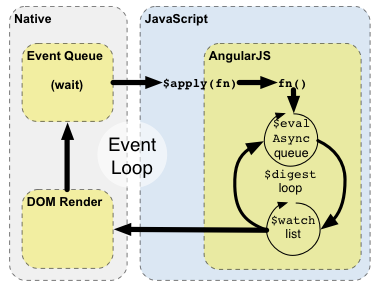

# $apply() & $digest() & $timeout() & $evalAsync()

* [What are Scopes?](https://docs.angularjs.org/guide/scope)
* [$watch, $apply, $digest 개념잡기](http://mobicon.tistory.com/328)



## $apply([exp])

`$apply()` is used to execute an expression in angular from outside of the angular framework.

```javascript
$apply: function(expr) {
    try {
      beginPhase('$apply');
      try {
        return this.$eval(expr);
      } finally {
        clearPhase();
      }
    } catch (e) {
      $exceptionHandler(e);
    } finally {
      try {
        $rootScope.$digest();
      } catch (e) {
        $exceptionHandler(e);
        // eslint-disable-next-line no-unsafe-finally
        throw e;
      }
    }
}
```
[source](https://github.com/angular/angular.js/blob/master/src/ng/rootScope.js#L1068)

## $digest()

Processes all of the watchers of the current scope and its children. [source](https://github.com/angular/angular.js/blob/master/src/ng/rootScope.js#L754)

```javascript
if (this === $rootScope && applyAsyncId !== null) {
  // If this is the root scope, and $applyAsync has scheduled a deferred $apply(), then
  // cancel the scheduled $apply and flush the queue of expressions to be evaluated.
  $browser.defer.cancel(applyAsyncId);
  flushApplyAsync();
}
```

## $timeout(prior to AngularJS 1.2.X.)

Angular's wrapper for `window.setTimeout`.

```javascript
var args = sliceArgs(arguments, 3),
  skipApply = (isDefined(invokeApply) && !invokeApply),
  deferred = (skipApply ? $$q : $q).defer(),
  promise = deferred.promise,
  timeoutId;

  timeoutId = $browser.defer(function() {
    try {
      deferred.resolve(fn.apply(null, args));
    } catch (e) {
      deferred.reject(e);
      $exceptionHandler(e);
    } finally {
      delete deferreds[promise.$$timeoutId];
    }

    if (!skipApply) $rootScope.$apply();
  }, delay);

  promise.$$timeoutId = timeoutId;
  deferreds[timeoutId] = deferred;
```
[source](https://github.com/angular/angular.js/blob/07849779ba365f371a8caa3b58e23f677cfdc5ad/src/ng/timeout.js#L53)
[$browser](https://github.com/angular/angular.js/blob/master/src/ng/browser.js)
[stack overflow](http://stackoverflow.com/questions/23070822/angular-scope-apply-vs-timeout-as-a-safe-apply)


    This object has two goals:

    - hide all the global state in the browser caused by the window object
    - abstract away all the browser specific features and inconsistencies

## $evalAsync(Over AngularJS 1.2.X)

Executes the expression on the current scope at a later point in time. [source](https://github.com/angular/angular.js/blob/master/src/ng/rootScope.js#L1005)

```javascript
// if we are outside of an $digest loop and this is the first time we are scheduling async
// task also schedule async auto-flush
if (!$rootScope.$$phase && !asyncQueue.length) {
  $browser.defer(function() {
    if (asyncQueue.length) {
      $rootScope.$digest();
    }
  });
}
```

[$scope.$evalAsync() vs. $timeout() In AngularJS](http://bennadel.github.io/JavaScript-Demos/demos/eval-async-vs-timeout-angularjs/)

## Example

[Plunker](https://embed.plnkr.co/hi6iGQ0KmaJD1xAZErYh/)

<iframe style="width: 100%; height: 600px" src="https://embed.plnkr.co/hi6iGQ0KmaJD1xAZErYh/" frameborder="0" allowfullscren="allowfullscren"></iframe>

# Reference

* [$rootScope.Scope](https://docs.angularjs.org/api/ng/type/$rootScope.Scope)
* [$apply vs $timeout vs $digest vs $evalAsync](http://www.codingeek.com/angularjs/angular-js-apply-timeout-digest-evalasync/)
* [$scope.$evalAsync() vs. $timeout() In AngularJS](https://www.bennadel.com/blog/2605-scope-evalasync-vs-timeout-in-angularjs.htm)
