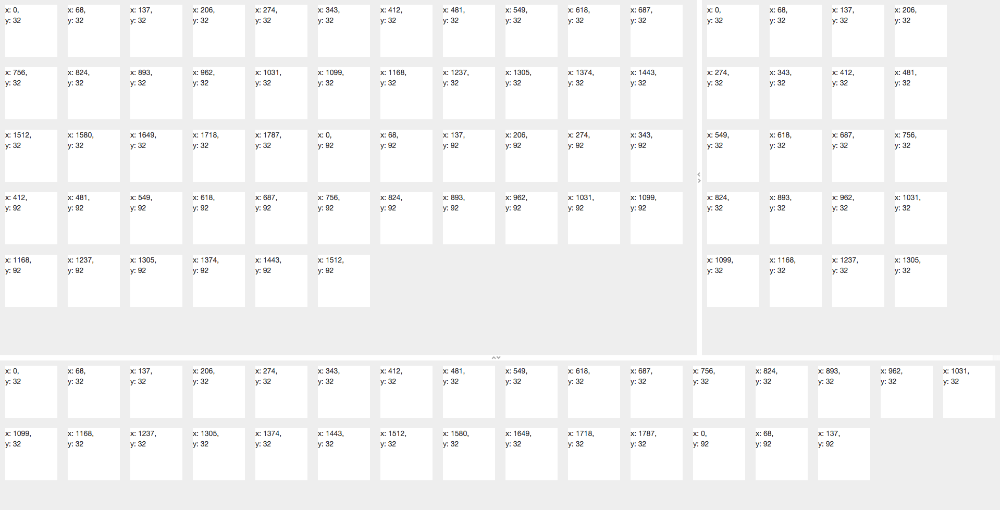
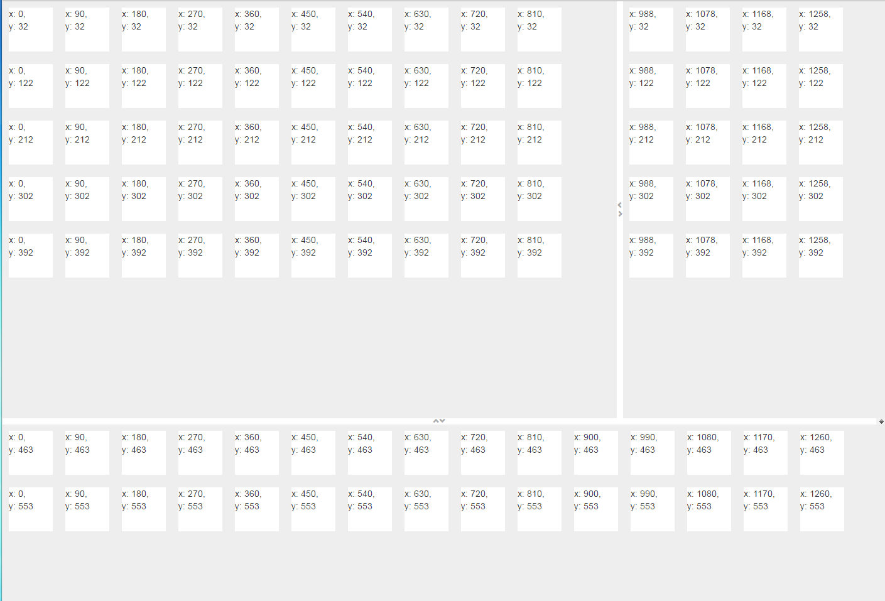

# How to run a directive after the dom has finished rendering

# Problem



```javascript
app.directive('sdiv', function ($timeout) {
    return {
        template:'<div style="background : #fff; width: {{width}}; height: {{height}}; margin : 10px; display:inline-block;"><span>x: {{x}}, <br>y: {{y}}</span></div>',
        restrict:"AE",
        scope: {
            width: "@",
            height: "@"
        },
        link: function (scope, element, attrs) {
            var offsetXY = offset(element);
            scope.x = offsetXY.left;
            scope.y = offsetXY.top;

            function offset(element) {
                var rawDomNode = element[0];
                var clientRect = rawDomNode.getBoundingClientRect();

                var body = document.documentElement || document.body;
                var scrollX = window.pageXOffset || body.scrollLeft;
                var scrollY = window.pageYOffset || body.scrollTop;
                var x = clientRect.left + scrollX;
                var y = clientRect.top + scrollY;
                return { left: parseInt(x), top: parseInt(y) };
            }
        }
    }
})
```

``<sdiv>``에 입력될 ``x``, ``y``가 먼저 렌더링되기전 값이 들어가 실제 값이랑 맞지않는 문제가 발생했다.

### Solution



```javascript
app.directive('sdiv', function ($timeout) {
    return {
        template:'<div style="background : #fff; width: {{width}}; height: {{height}}; margin : 10px; display:inline-block;"><span>x: {{x}}, <br>y: {{y}}</span></div>',
        restrict:"AE",
        scope: {
            width: "@",
            height: "@"
        },
        link: function (scope, element, attrs) {
            $timeout(function(){
                var offsetXY = offset(element);
                scope.x = offsetXY.left;
                scope.y = offsetXY.top;
            });

            function offset(element) {
                var rawDomNode = element[0];
                var clientRect = rawDomNode.getBoundingClientRect();

                var body = document.documentElement || document.body;
                var scrollX = window.pageXOffset || body.scrollLeft;
                var scrollY = window.pageYOffset || body.scrollTop;
                var x = clientRect.left + scrollX;
                var y = clientRect.top + scrollY;
                return { left: parseInt(x), top: parseInt(y) };
            }
        }
    }
})
```

아래와 같이 ``$timeout``을 사용하니 정상적으로 작동하였다.

```javascript
$timeout(function(){
    var offsetXY = offset(element);
    scope.x = offsetXY.left;
    scope.y = offsetXY.top;
});
```

### Addtion

```javascript
$timeout(function(){
    var offsetXY = offset(element);
    scope.x = offsetXY.left;
    scope.y = offsetXY.top;
}, 10);
```

`$timeout(func)`을 사용하여도 새로고침을 다수 수행하였을 때, 작동을 안하는 경우가 종종 발견되었다. 이를 해결하기 위해 `$timeout(func, num)`에 연기할 시간을 주면 정상적으로 작동하였다.

### Reference

* [$timeout](https://docs.angularjs.org/api/ng/service/$timeout)
* [stack overflow](http://stackoverflow.com/questions/12240639/how-can-i-run-a-directive-after-the-dom-has-finished-rendering)
* [Run a directive after the DOM has finished rendering](http://blog.brunoscopelliti.com/run-a-directive-after-the-dom-has-finished-rendering/)
* [[AngularJS] 쉽지만 쉽지않은 $timeout 서비스](http://programmingsummaries.tistory.com/348)