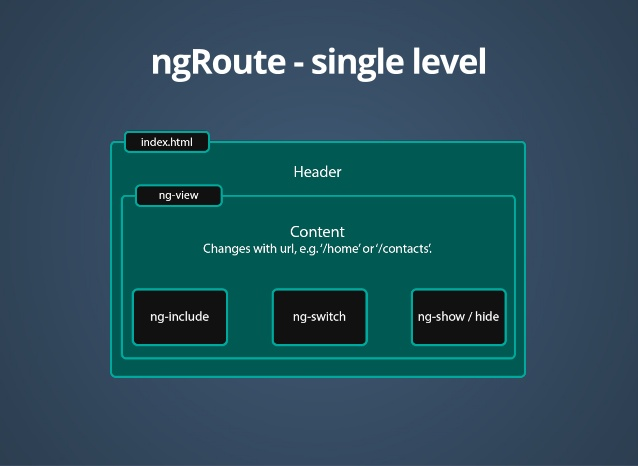
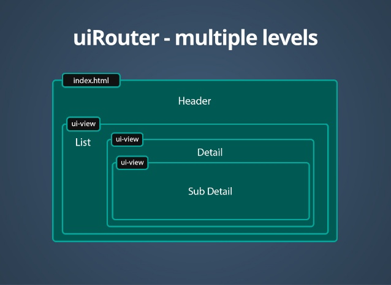
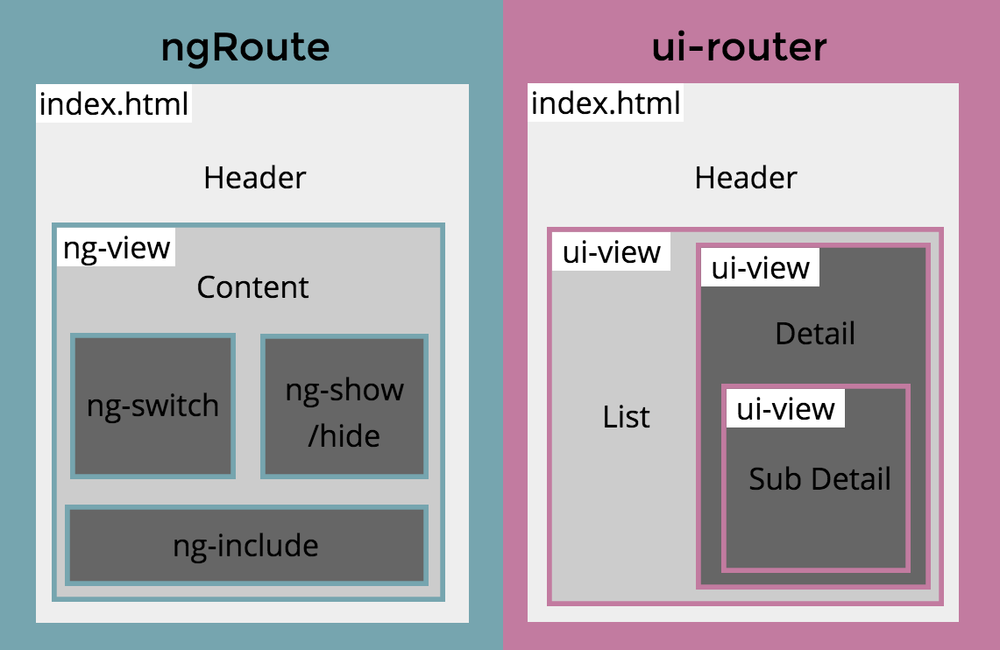
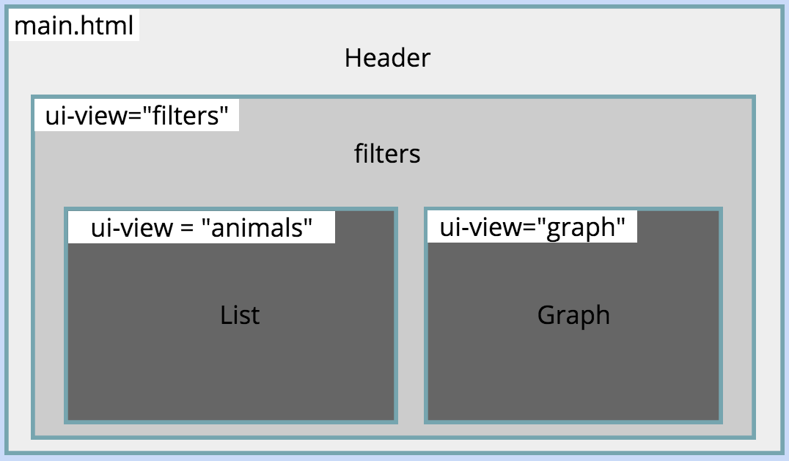
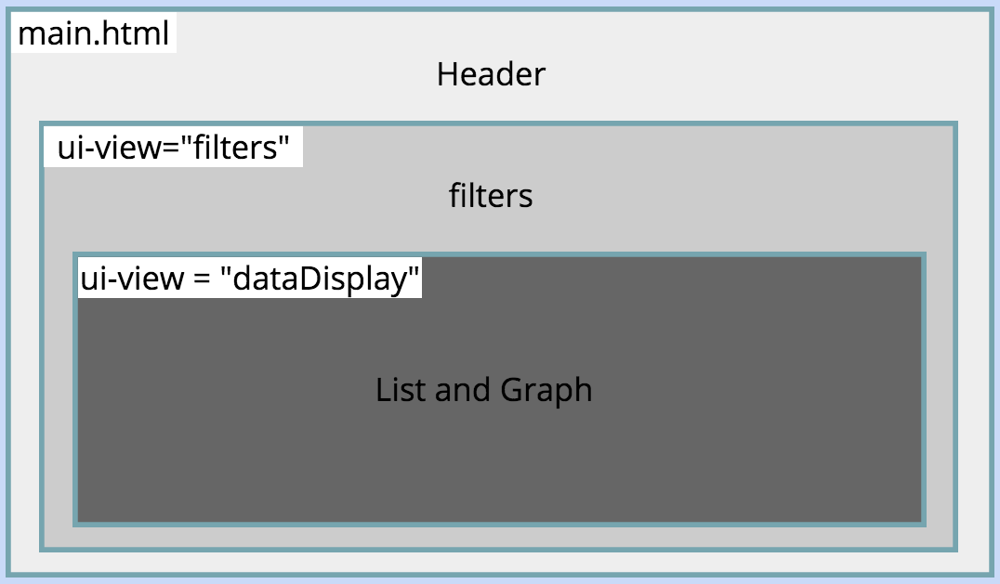
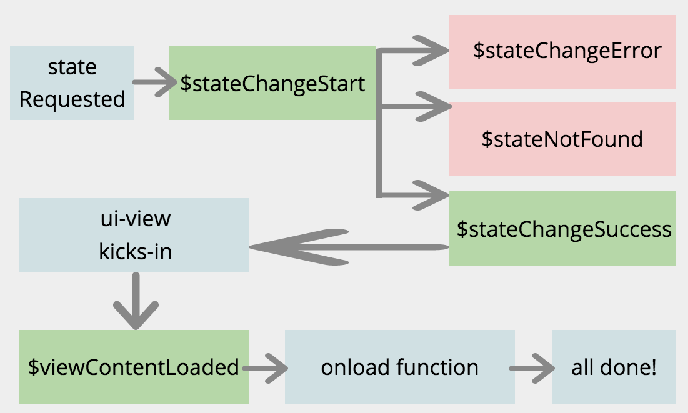
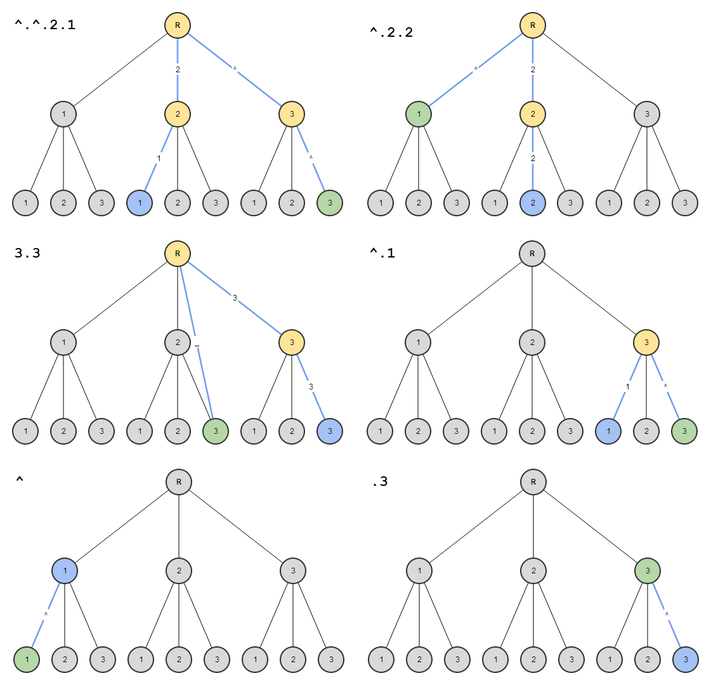

# ngRouter & uiRouter

### Router framework

Routing frameworks for SPAs **update the browser's URL as the user navigates** through the app. Conversely, this allows **changes to the browser's URL to drive navigation** through the app, thus allowing the **user to create a bookmark to a location** deep within the SPA.

### ngRoute

routes는 ``$route`` service에서 제공하는 ``$routeProvider`` 를 통해서 정의된다. 이 서비스는 ``controller``와 ``view``에 해당되는 ``template`` 그리고 현재 ``url`` location 을 쉽게 엮어준다.



### uiRouter

nested views를 가진 유연한 라우팅을 위한 AngularJS 사실 상의 솔루션이다.

* Nested States는 하나의 상태에서 하위로 state값을 확장해나가는 것을 의미



### ngRoute vs. uiRouter

#### 공통점

* ``url`` 설정(uiRouter에서는 optional)
* ``template`` or ``tempalteUrl`` 설정
* view에 필요시 ``controller`` 할당
* ``when()``일때 redirect
* invalid url을 ``thoerwise()``로 한꺼번에 핸들링
* url parameter를 사용

#### 차이점

|  | routes | states |
| --- | ------ | ------ |
| Names | url을 설정 | names를 설정 |
| Navigate | url 이용 | state, url 이용 |
| View | 하나의 view | 여러개의 view |
| Hierarchy | flat hierarchy | nested hierarchy |

##### ngRoute

```javascript
$routeProvider
    .when('/home', {
        templateUrl: 'partial-home.html'
    })
    .when('/home/list', {
        templateUrl: 'partial-home-list.html',
        controller: function($scope) {
            $scope.dogs = ['Bernese', 'Husky', 'Goldendoodle'];
        }
    })
    .when('/home/paragraph',{
        url: '/paragraph',
        template: 'I could sure use a drink right now.'
    })
```

##### uiRoute

```javascript
$stateProvider
    .state('home', {
        url: '/home',
        templateUrl: 'partial-home.html'
    })

    // nested list with custom controller
    .state('home.list', {
        url: '/list',
        templateUrl: 'partial-home-list.html',
        controller: function($scope) {
            $scope.dogs = ['Bernese', 'Husky', 'Goldendoodle'];
        }
    })

    // nested list with just some random string data
    .state('home.paragraph', {
        url: '/paragraph',
        template: 'I could sure use a drink right now.'
    })
```

* Multiple views의 경우 같은 노드 상에 여러개의 ui-view 존재

```xml
<!-- partial-about.html -->

<div class="jumbotron text-center">
    <h1>The About Page</h1>
    <p>This page demonstrates <span class="text-danger">multiple</span> and <span class="text-danger">named</span> views.</p>
</div>

<div class="row">

    <!-- COLUMN ONE NAMED VIEW -->
    <div class="col-sm-6">
        <div ui-view="columnOne"></div>
    </div>

    <!-- COLUMN TWO NAMED VIEW -->
    <div class="col-sm-6">
        <div ui-view="columnTwo"></div>
    </div>

</div>
```



### 사용법

1. 의존성 주입
2. config block에서 ``$stateProvider`` 설정
3. template 에서 ``ui-view`` 설정

```javascript
$stateProvider
    .state('home',	// state name
    {				// stateConfig options
        url: '/home',
        templateUrl: 'partial-home.html'
    })
```

#### [Nested States and Nested Views](https://github.com/angular-ui/ui-router/wiki/Nested-States-and-Nested-Views)
##### view nesting by state name

```javascript
$stateProvider
    .state('home', {
        url: '/home',
        templateUrl: 'partial-home.html'
    })

    .state('home.list',	{	// view nesting by state name
        url: '/list',
        templateUrl: 'partial-home-list.html',
        controller: function($scope) {
            $scope.dogs = ['Bernese', 'Husky', 'Goldendoodle'];
        }
    })
```
* [Registering States Order](https://github.com/angular-ui/ui-router/wiki/Nested-States-and-Nested-Views#registering-states-order) : You can register states in any order and across modules. You can register children before the parent state exists.
* [Parent MUST Exist](https://github.com/angular-ui/ui-router/wiki/Nested-States-and-Nested-Views#parent-must-exist) : If you register only a single state, like ``home.list``, you MUST define a state called contacts at some point, or else no states will be registered.
* [Naming Your States](https://github.com/angular-ui/ui-router/wiki/Nested-States-and-Nested-Views#naming-your-states) : No two states can have the same name.
* [Nested States & Views](https://github.com/angular-ui/ui-router/wiki/Nested-States-and-Nested-Views#nested-states--views) : When the application is in a particular state—when a state is "active"—all of its ancestor states are implicitly active as well.

##### view nesting by parent property

```javascript
$stateProvider
	.state('home', {
        url: '/home',
        templateUrl: 'partial-home.html'
    })

    .state('list', {	// view nesting by parent config
    	parent: 'home',
        url: '/list',
        templateUrl: 'partial-home-list.html',
        controller: function($scope) {
            $scope.dogs = ['Bernese', 'Husky', 'Goldendoodle'];
        }
    })
```

##### view nesting by object-based states

```javascript
var contacts = { 
    name: 'contacts',  //mandatory
    templateUrl: 'contacts.html'
}
var contactsList = { 
    name: 'contacts.list', //mandatory. This counter-intuitive requirement addressed in issue #368
    parent: contacts,  //mandatory
    templateUrl: 'contacts.list.html'
}

$stateProvider
  .state(contacts) //view nesting by object-based states
  .state(contactsList)
```

#### template

```xml
<!-- index.html -->
<body ng-app>
<div ui-view></div> <!-- unnamed view -->
<div ui-view="list"></div><!-- named view -->
</body>
```

* 각 ``template``/``templateUrl``은 parent state의 template 속 ``ui-view`` directive에 삽입된다.

#### views

```javascript
$stateProvider
    .state('home', {
        url: '/home',
        views: {
        	list: {
            	templateUrl: 'partial-home-list.html'
            },
            paragraph: {
            	templateUrl: 'partial-home-paragraph.html'
            }
        }
    })
```

* 하나의 ``state``에 여러개의 view를 nesting 하거나 보다 명시적으로 적고 싶을 때 ``views``를 설정한다. (단, view의 이름은 중복될 수 없다.)

#### [Relative & Absolute Naming](https://github.com/angular-ui/ui-router/wiki/Multiple-Named-Views#view-names---relative-vs-absolute-names)

```javascript
$stateProvider
    .state('home', {
        url: '/home',
        views: {
        	// the main template will be placed here (relatively named)
        	'': { templateUrl: 'partial-home.html' },

      		// the child views will be defined here (absolutely named)
        	'list@home': {
            	templateUrl: 'partial-home-list.html'
            },
            'paragraph@home': {
            	templateUrl: 'partial-home-paragraph.html'
            }
        }
    })
```

* ``@``를 기준으로 앞쪽에는 정의하려는 뷰의 이름, 뒤쪽에는 상태이름을 명시함으로서 "현재 이 view가 어떤 state의 자식이다"라는 것을 알려준다. (위의 Nasted view에서는 ``.``을 통해 자식이라는 것을 표현하였지만 내부적으로 이름이 변환 될 때는 절대 이름으로 바뀐다.)
* ``''``는 main Templete을 맵핑 시키기 위한 정의이다. 이렇게 정의하면 home state에 대한 main Templete는 ``patial-home.html``로서 맵핑 되고, 나머지 ``list``과 ``paragraph``는 자식으로서 각각의 템플릿이 맵핑된다.


* Relative (always parent)
	* ``'filter'`` : 'filter' view in parent template
	* ``''`` : unnamed view in parent template
* Absolute(uses ``@`` symbol)
	* ``'filters@report'`` : 'filters' view in 'report' state's template
	* ``'filters@'`` : 'filters' view in index.html
	* ``'@report'`` : unnamed view in 'report' state's template

``` javascript
$stateProvider
  .state('contacts', {
    // This will get automatically plugged into the unnamed ui-view 
    // of the parent state template. Since this is a top level state, 
    // its parent state template is index.html.
    templateUrl: 'contacts.html'   
  })
  .state('contacts.detail', {
    views: {
        ////////////////////////////////////
        // Relative Targeting             //
        // Targets parent state ui-view's //
        ////////////////////////////////////

        // Relatively targets the 'detail' view in this state's parent state, 'contacts'.
        // <div ui-view='detail'/> within contacts.html
        "detail" : { },            

        // Relatively targets the unnamed view in this state's parent state, 'contacts'.
        // <div ui-view/> within contacts.html
        "" : { }, 

        ///////////////////////////////////////////////////////
        // Absolute Targeting using '@'                      //
        // Targets any view within this state or an ancestor //
        ///////////////////////////////////////////////////////

        // Absolutely targets the 'info' view in this state, 'contacts.detail'.
        // <div ui-view='info'/> within contacts.detail.html
        "info@contacts.detail" : { }

        // Absolutely targets the 'detail' view in the 'contacts' state.
        // <div ui-view='detail'/> within contacts.html
        "detail@contacts" : { }

        // Absolutely targets the unnamed view in parent 'contacts' state.
        // <div ui-view/> within contacts.html
        "@contacts" : { }

        // absolutely targets the 'status' view in root unnamed state.
        // <div ui-view='status'/> within index.html
        "status@" : { }

        // absolutely targets the unnamed view in root unnamed state.
        // <div ui-view/> within index.html
        "@" : { } 
  });
```

#### [UrlMatcher](http://angular-ui.github.io/ui-router/site/#/api/ui.router.util.type:UrlMatcher)

Matches URLs against patterns and extracts named parameters from the path or the search part of the URL. A URL pattern consists of a path pattern, optionally followed by '?' and a list of search parameters.

* ``:`` name - colon placeholder
* ``*`` name - catch-all placeholder
* ``{`` name ``}`` - curly placeholder
* ``{`` name ``:`` regexp|type ``}`` - curly placeholder with regexp or type name. Should the regexp itself contain curly braces, they must be in matched pairs or escaped with a backslash.

##### Example

* ``/hello/`` - Matches only if the path is exactly ``/hello/``. There is no special treatment for trailing slashes, and patterns have to match the entire path, not just a prefix.
* ``/user/:id`` - Matches ``/user/bob`` or ``/user/1234!!!`` or even ``/user/`` but not ``/user`` or ``/user/bob/details``. The second path segment will be captured as the parameter ``id``.
* ``/user/{id}`` - Same as the previous example, but using curly brace syntax.
* ``/user/{id:[^/]*}`` - Same as the previous example.
* ``/user/{id:[0-9a-fA-F]{1,8}}`` - Similar to the previous example, but only matches if the id parameter consists of 1 to 8 hex digits.
* ``/files/{path:.*}`` - Matches any URL starting with ``/files/`` and captures the rest of the path into the parameter ``path``.
* ``/files/*path`` - ditto.
* ``/calendar/{start:date}`` - Matches ``/calendar/2014-11-12`` (because the pattern defined in the built-in date Type matches 2014-11-12) and provides a Date object in $stateParams.start


### 주의점

route 구조를 잡을 때, 정말 하나의 state template에 multiple named views가 필요한지 먼저 생각해 볼 필요가 있다. 대부분의 경우 view를 하나씩 nesting 해도 해결되기 때문이다. "각 view들이 별도의 scope으로 분리가 필요한가", '" view들이 서로 어떻게 의존적인가" 를 고려하여 판단한다.





filters의 조건에 list와 graph가 동일하게 영향을 받으면 list와 graph는 filters에 의존적/종속적이고, list와 graph는 filters를 parent로 가질 수 있다. 만일 list와 graph가 seperated scope이 필요하다면, 두개의 별도의 named view가 될 필요가 있고, 아니라면 하나의 view로 표현할 수 있다.

### How to active state

#### state의 life-cycle과 event



#### state를 activate시키는 방법

##### state가 가진 url로 직접 이동
##### ui-sref directive 안의 link를 클릭

Before compiled:
```xml
<a ui-sref="home">Home</a> | <a ui-sref="about">About</a> | <a ui-sref="{page: 2}">Next page</a>

<ul>
    <li ng-repeat="contact in contacts">
        <a ui-sref="contacts.detail({ id: contact.id })">{{ contact.name }}</a>
    </li>
</ul>
```

After compiled:
```xml
<a href="#/home" ui-sref="home">Home</a> | <a href="#/about" ui-sref="about">About</a> | <a href="#/contacts?page=2" ui-sref="{page: 2}">Next page</a>

<ul>
    <li ng-repeat="contact in contacts">
        <a href="#/contacts/1" ui-sref="contacts.detail({ id: contact.id })">Joe</a>
    </li>
    <li ng-repeat="contact in contacts">
        <a href="#/contacts/2" ui-sref="contacts.detail({ id: contact.id })">Alice</a>
    </li>
    <li ng-repeat="contact in contacts">
        <a href="#/contacts/3" ui-sref="contacts.detail({ id: contact.id })">Bob</a>
    </li>
</ul>

<a ui-sref="home" ui-sref-opts="{reload: true}">Home</a>
```

##### $state.go()

$state.go() 를 사용해
여러가지 필요한 연산 후에 이동 가능

```xml
<ul>
  <li ng-repeat="item in animalList"
  ng-click="vm.getAnimalDetail({item.id})">
  상세보기</li>
<ul>
```

```javascript
function getAnimalDetail(itemId) {
  animalService.getAnimals({id:itemId}).$promise
  .then(function(result){
    //필요한 작업 수행
    //필요한 작업 수행
    $state.go('animal.detail',{animalId: result.id})
  })
  .catch(function(error){
  })
}
```

#### Relative Navigation




You can naviate relative to current state by using special character.

* ``^`` : up
* ``.`` : down

### 참조

* [GitHub](https://github.com/angular-ui/ui-router)
* [API](http://angular-ui.github.io/ui-router/site/#/api)
* [AngularJS 실전: UI-Router 정복하기](http://slides.com/lsw/ui-router#/)
* [ui-router framework 파헤치기](https://makeyourif.wordpress.com/2015/09/18/ionic-framework%EC%97%90%EC%84%9C%EC%9D%98-routing-%EC%B2%98%EB%A6%AC/)
* [angularjs, ui-router를 이용한 사용자 인증 처리](http://miconblog.com/archives/2014/11/anguarjs-ui-router%EB%A5%BC-%EC%9D%B4%EC%9A%A9%ED%95%9C-%EC%82%AC%EC%9A%A9%EC%9E%90-%EC%9D%B8%EC%A6%9D-%EC%B2%98%EB%A6%AC/)
* [Angular Promises and Advanced Routing](http://www.slideshare.net/alexebogdan/angular-promisesandadvancedrouting?related=1%20ng-switch%20ng-show%20/hide%20index.html%20ui-view%20List%20Header%20ui-view%20ui-view%20Detail%20Sub%20Detail%20ui-router%20ngRoute)
* [Angular js routing options](http://www.slideshare.net/nirkaufman/angular-js-routing-options)
