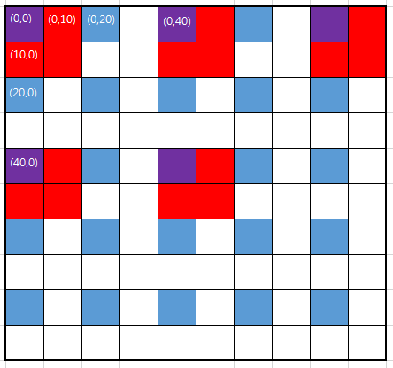

# drawImage and setTransform Performance

### drawImage

```javascript
drawImage(img,x,y)
drawImage(image, dx, dy)
```
> Position the image on the canvas

```javascript
drawImage(img,x,y,width,height)
drawImage(image, dx, dy, dw, dh)
```
> Position the image on the canvas, and specify width and height of the image

```javascript
drawImage(img,sx,sy,swidth,sheight,x,y,width,height)
drawImage(image, sx, sy, sw, sh, dx, dy, dw, dh)
```
> Clip the image and position the clipped part on the canvas

* [HTML canvas drawImage() Method](http://www.w3schools.com/tags/canvas_drawimage.asp)


> * If not specified, **the dw and dh arguments must default to the values of sw and sh**, interpreted such that one CSS pixel in the image is treated as one unit in the output bitmap's coordinate space.
> * If **the sx, sy, sw, and sh arguments are omitted, they must default to 0, 0, the image's intrinsic width in image pixels, and the image's intrinsic height in image pixels, respectively**.
> * Paint the region of the image argument specified by the source rectangle on the region of the rendering context's output bitmap specified by the destination rectangle, **after applying the [current transformation matrix](https://html.spec.whatwg.org/multipage/scripting.html#current-transformation-matrix) to the destination rectangle**.
> * If the original image data is a bitmap image, the value painted at a point in the destination rectangle is computed by filtering the original image data. The **user agent may use any filtering algorithm** (for example **bilinear interpolation or nearest-neighbor**). When the filtering algorithm requires a pixel value from outside the original image data, it must instead use the value from the nearest edge pixel.

* [Drawing images](https://html.spec.whatwg.org/multipage/scripting.html#dom-context-2d-drawimage)
* [Transformations](https://html.spec.whatwg.org/multipage/scripting.html#current-transformation-matrix)

### setTransform

```javascript
setTransform(scaleX, skewX, skewY, scaleY, translateX, translateY)
```

> The ``setTransform()`` and ``transform()`` functions use "matrix" calculations to transform the canvas. It's a combination of the ``scale()`` and ``translate()`` functions and also allows the skewing of the canvas.

* [An example of the transform and setTransform functions](http://www.rgraph.net/blog/2013/february/an-example-of-the-html5-canvas-transform-function.html)



* scale = 1 : [(0, 10)] * [(1,0),(0,1)] = [(0, 10)]
* scale = 2 : [(0, 10)] * [(2,0),(0,2)] = [(0, 20)]
* scale = 2 : [(0, 20)] * [(2,0),(0,2)] = [(0, 40)]

### drawImage vs. setTransform

```javascript
for (var x = 0; x < 62500; x ++) {
  var rectCanvas = document.createElement('canvas');
  var rectCtx = rectCanvas.getContext('2d');
  rectCanvas.width  = size;
  rectCanvas.height = size;
  rectCtx.fillStyle = '#'+Math.round(0xffffff * Math.random()).toString(16);
  rectCtx.fillRect(0, 0, size, size);
  list.push(rectCanvas);
}

...

function draw(type) {
  var i = 0;
  var inc = size * scale * 2;
  // ctx.fillStyle = '#ffffff';
  // ctx.fillRect(0, 0, 5000, 5000);
  ctx.clearRect(0, 0, 5000, 5000);

  if(type==4){
    ctx.setTransform(scale, 0, 0, scale, move, move);
    inc = size * 2;
  }
  for (var r = 0; r < 5000; r += inc) {
    for (var c = 0; c < 5000; c += inc) {
      var rect = list[i++];
      
      ctx.save();
      drawImg(type, rect, r, c, size);
      ctx.restore();
      
      if(i > list.length) {
        return;
      }
    }
  }
}

function drawImg(type, img, r, c, s) {
  var movedR = r + move;
  var movedC = c + move;
  var scaledS = s * scale;
 
  switch(type) {
    case 1:
      ctx.drawImage(img, movedC, movedR);
      break;
    case 2:
      ctx.drawImage(img, movedC, movedR, scaledS, scaledS);
      break;
    case 3:
      ctx.drawImage(img, 0, 0, size, size, movedC, movedR, scaledS, scaledS);
      break;
    case 4:
      ctx.drawImage(img, c, r);
      break;
  }
}
...
```

| scale | drawImage1 | drawImage2 | drawImage3 | drawImage + setTransform |
| :---: | :---: | :---: | :---: | :---: |
| 1 | 101.9 | 102 | 108 | 100 |
| 2 | 23.5 | 24.2 | 23.2 | 75 |
| 5 | 2.4 | 2.2 | 2.4 | 64.3 |
| 10 | 0.5 | 0.5 | 0.5 | 62.9 |
| 20 | 0.1 | 0.1 | 0.1 | 64 |

* [Plunker](https://embed.plnkr.co/KDhwFwM4RYgYLo1HxyAQ/)

<iframe style="width: 100%; height: 600px" src="https://embed.plnkr.co/KDhwFwM4RYgYLo1HxyAQ" frameborder="0" allowfullscren="allowfullscren"></iframe>

### Reference

* [캔버스 변환: setTransform](http://rayuela.kr/htmlcss/post1082/)
* [Optimizing canvas](https://developer.mozilla.org/ko/docs/Web/API/Canvas_API/Tutorial/Optimizing_canvas)