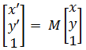

# Get screen position

## World to View



## View to World


## Example

```javascript
function coordinateTransform(screenPoint, someSvgObject)
{
  var CTM = someSvgObject.getScreenCTM();
  return screenPoint.matrixTransform( CTM.inverse() );
}
```

## Reference

* [SVG 좌표 변형](https://msdn.microsoft.com/ko-kr/library/hh535760(v=vs.85).aspx)