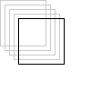
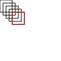
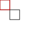

# transform vs setTransform method

```javascript
context.transform(scaleX, skewX, skewY, scaleY, translateX, translateY);

context.setTransform(scaleX, skewX, skewY, scaleY, translateX, translateY);
```

* `scaleX`: Increases or decreases the size of the pixels in the X direction
* `skewX`: This effectively angles the X axis up or down
* `skewY`: This effectively angles the Y axis left or right
* `scaleY`: Increases or decreases the size of the pixels in the Y direction
* `translateX`: Moves the whole coordinate system in the X direction (so [0,0] is moved left or right)
* `translateY`: Moves the whole coordinate system in the Y direction (so [0,0] is moved up or down)

At first the two functions may seem similar. However when you start to do multiple transformations the difference may become apparent. The `transform()` function ADDS the transformation that you give it to whatever the current transform is. Whereas the `setTransform()` SETS it to whatever you give it.

```javascript
context.transform(1,0,0,1,5,5); // A translate by [5,5]
context.transform(1,0,0,1,5,5); // A translate by [5,5]
context.transform(1,0,0,1,5,5); // A translate by [5,5]
context.transform(1,0,0,1,5,5); // A translate by [5,5]
```



Has the same result as this:

```javascript
context.setTransform(1,0,0,1,20,20); // A translate by [20,20]
```


```javascript
var canvas1 = document.getElementById('canvas1');
var ctx1 = canvas1.getContext('2d');
var canvas2 = document.getElementById('canvas2');
var ctx2 = canvas2.getContext('2d');

function render() {
  ctx1.strokeRect(0,0,20,20);
  ctx1.transform(1,0,0,1,5,5); // A translate by [5,5]
  ctx1.strokeRect(0,0,20,20);
  ctx1.transform(1,0,0,1,5,5); // A translate by [5,5]
  ctx1.strokeRect(0,0,20,20);
  ctx1.transform(1,0,0,1,5,5); // A translate by [5,5]
  ctx1.strokeRect(0,0,20,20);
  ctx1.transform(1,0,0,1,5,5); // A translate by [5,5]
  ctx1.strokeRect(0,0,20,20);
  ctx1.transform(1,0,0,1,0,0); // A translate by [0,0]
  ctx1.strokeStyle="red";
  ctx1.strokeRect(0,0,20,20);
  
  
  ctx2.strokeRect(0,0,20,20);
  ctx2.setTransform(1,0,0,1,20,20); // A translate by [20,20]
  ctx2.strokeRect(0,0,20,20);
  ctx2.setTransform(1,0,0,1,0,0); // A translate by [0,0]
  ctx2.strokeStyle="red";
  ctx2.strokeRect(0,0,20,20);
}
```

* [Plunker](https://plnkr.co/edit/va5xfX?p=preview)





`transform` add a new transformation matrix, but `setTransform` reset and create a new transformation matrix. Notice that each time you call `transform()`, it builds on the previous transformation matrix. Otherwise each time you call `setTransform()`, it resets the previous transformation matrix and then builds the new matrix.

## Reference

* [An example of the transform and setTransform functions](http://www.rgraph.net/blog/an-example-of-the-html5-canvas-transform-function.html)
* [HTML canvas setTransform() Method](http://www.w3schools.com/TAgs/canvas_settransform.asp)
* [HTML canvas transform() Method](http://www.w3schools.com/TAgs/canvas_transform.asp)

