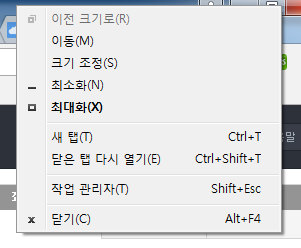

# Chrome memory check

## Task manager

* `shift` + `esc`

## Inspector

* Timeline
* Profile

## Reference

* [Chrome Devtools를 이용한 Web Application Memory 분석법](http://sculove.github.io/blog/2016/10/05/memory/)