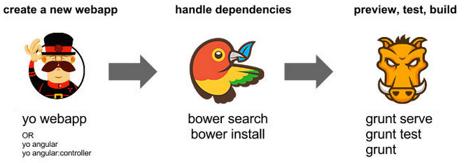

# 프론트엔드 개발 도구

### [Yeoman](http://yeoman.io/)

Yeoman 은 프론트엔드 개발을 위한 코드 자동 생성, 모듈 관리 및 빌드 도구를 통칭한다. Yeoman 은 소스를 내려받을 때 Git을 이용하고 자바스크립트로 작성됐기 때문에 노드 위에서 구동된다. Yeoman은 3가지 서로 다른 기능을 제공하는 도구를 합쳐 놓았다.



최초에 기본적인 애플리케이션 구조를 생성한 후 필요한 기능 요소를 자동으로 생성할 수 있다. 원하는 기능이 담긴 파일을 자동으로 생성해 주는 것을 제너레이터라고 하며, 다양한 언어와 프레임워크에 맞춘 제네레이터를 제공하고 yo는 제너레이터를 통해 파일을 생성해준다. yo를 설치하고 애플리케이션 특성에 맞는 제너레이터를 찾아 설치하면 애플리케이션의 초기 골격을 만드거나 필요한 기능 요소의 파일을 자동으로 생성해 개발을 빠르게 진행할 수 있다.

* yo 도구를 이용해 파일 자동 생성 기능을 제공한다.
* bower 도구를 이용해 프론트엔드 의존성 라이브러리를 원격으로부터 내려받아 설치하고  ``index.html``에 자동으로 설정해준다.
* grunt 도구를 이용해 프런트엔드 Assets(HTML, CSS, JS)의 테스트, 통합, 압축 등 빌드 배포 작업을 수행한다.

#### 설치

```bash
npm install -g yo bower grunt-cli
npm install -g generator-angular
node --version && yo --version && bower --version && grunt --version

v4.4.7
1.8.4
1.7.9
grunt-cli v1.2.0
```

#### 생성

```bash
mkdir todo && cd todo
yo angular MyToDo
```

#### 주의

16.08.16 기준으로 ``generator-angular``에 ``component``와 ``uiRouter``에 대한 제너레이터가 존재하지 않는다. GitHub에 해당 관련한 Issue가 등록되어 있으며, Pull Request 또한 등록되어 있지만 Merge되지 않고 있다.

### [Bower](https://bower.io/)

bower는 트위터에서 애플리케이션 개발 시 클라이언트 모듈의 배포 및 의존성 관리를 위한 도구로 만들었다. bower를 이용해 내려받는 라이브러리는 GitHub과 같은 Git 저장소에 등록돼 있어야 하고, 누구나 자신의 라이브러리를 원격 bower 저장소에 등록할 수 있다.

#### 설치

```bash
npm install -g bower
```

#### 사용법

##### Install packages

```bash
bower install <package>

# installs the project dependencies listed in bower.json
bower install
# registered package
bower install jquery
# registered specific version package
bower install angular#1.5.7
# GitHub shorthand
bower install desandro/masonry
# Git endpoint
bower install git://github.com/user/package.git
# URL
bower install http://example.com/script.js
```

* ``-S``, ``--save``: Save installed packages into the project’s bower.json dependencies
* ``-D``, ``--save-dev:`` Save installed packages into the project’s bower.json devDependencies

##### List packages

```bash
bower list

myToDo#0.0.0 C:\workspace\test\todo4
├── angular#1.5.8 (1.5.9-build.4992+sha.a272a3c available)
...
├── jquery#2.1.4 (latest is 3.1.0)
├── malarkey#1.3.3
└── moment#2.10.6 (latest is 2.14.1)
```

##### Search packages

```bash
bower search <package>

Search results:

	jui https://github.com/seogi1004/jui.git
    juis https://github.com/JLTiPL/JUIS.git
    jui-core https://github.com/juijs/jui-core.git
    jui-grid https://github.com/juijs/jui-grid.git
    ...
    juicerjs https://github.com/jsnanigans/juicerjs.git
```

##### Create a bower.json

```bash
bower init
```

##### Configuation

###### bower.json

``bower init``을 사용해 생성되며, 의존성 라이브러리들이 설정된다. ``bower install <package> --save`` 혹은 ``bower install <package> --save-dev``를 사용해 라이브러리를 추가하며, 설정시 충돌난 라이브러리는 ``resolutions``를 통해 해결된다.

```javascript
{
  "name": "myToDo",
  "version": "0.0.0",
  "dependencies": {
    "angular-animate": "~1.5.3",
    ...
    "angular": "~1.5.3"
  },
  "devDependencies": {
    "angular-mocks": "~1.5.3"
  },
  "overrides": {
    "bootstrap-sass": {
      "main": [
        "assets/stylesheets/_bootstrap.scss",
        ...
        "assets/fonts/bootstrap/glyphicons-halflings-regular.woff2"
      ]
    }
  },
  "resolutions": {
    "jquery": "~2.1.4",
    "angular": "~1.5.3"
  }
}
```

###### .bowerrc

``.bowerrc``환경 파일에는 ``bower install`` 명령 수행 시 모듈을 내려받아 설치할 폴더 위치가 설정돼 있다.

```javascript
{
	"directory": "bower_components"
}
```

### [Grunt](http://gruntjs.com/)

grunt는 애플리케이션을 위한 Task Runner 도구로 자바의 Ant와 유사하다. grunt는 테스트, 통합, 압축 등 하나의 할 일 단위를 Task라고 부르고, 각 Task를 위한 플러그인을 제공한다. 원하는 기능이 있다면 Task Plugin을 http://gruntjs.com/plugins 사이트에서 검색해 NPM을 이용해 설치한 후 grunt 환경 파일에 Task를 설정한다.

#### 설치

```bash
npm install -g grunt-cli
npm install grunt --save-dev
npm init
```

#### 사용법

##### Install plugins

```bash
npm install <plugins> --save-dev
```

##### Run command

```bash
grunt <command>
```

#### 자주 쓰이는 Plugin

* grunt-contrib-concat : File을 통합한다.
* grunt-contrib-uglify : UglifyJS를 통한 file minifying.
* grunt-contrib-jshint : JSHint를 통한 file Validation.
* grunt-contrib-cssmin : CSS 파일을 압축한다.

### [Gulp](http://gulpjs.com/)

grunt와 유사한 빌드 도구이다. grunt와 달리 node.js의 스트림을 기반으로 하는 빌드 시스템이며, 설정 기반이 아니라 Javascript(Nodejs) 코드로 테스크의 작업을 실행 시킬수 있다. . Yeoman 에서는 grunt를 기본으로 하고 있지만, 최신 앵귤러 버전의 빌드 도구로 gulp를 사용하고 있어 점점 인지도가 높아지고 있다.

#### Gulp vs. Grunt

| Gulp | Grunt |
| ---- | ----- |
| Faster because of streams | Huge community |
| 1,916 plugins | 5,328 plugins |
| Code over configure | Been around longer |
| Shorter files | Used in big production sites |

##### gruntfile.js

```javascript
module.exports = function(grunt) {
 
  // Project configuration.
  grunt.initConfig({
    sass: {
      dist: {
        files: {
          'sass/styles.scss': 'css/styles.css'
        }
      }
    },
 
    autoprefixer: {
      single_file: {
        options: {
          browsers: ['last 2 version', 'ie 8', 'ie 9']
        },
        src: 'css/styles.css',
        dest: 'css/styles.css'
      },
    },
 
    watch: {
      sass: {
        files: 'sass/*.scss',
        tasks: ['sass', 'autoprefixer'],
      }
    },
  });
 
  grunt.loadNpmTasks('grunt-autoprefixer');
  grunt.loadNpmTasks('grunt-contrib-sass');
  grunt.loadNpmTasks('grunt-contrib-watch');
 
  // Default task
  grunt.registerTask('default', ['watch']);
};
```

##### gulpfile.js

```javascript
var gulp = require('gulp');
     sass = require('gulp-sass');
     autoprefixer = require('gulp-autoprefixer');
 
// Styles
gulp.task('styles', function() {
    gulp.src('sass/styles.scss')
        .pipe(sass())
        .pipe(autoprefixer('last 1 version', '> 1%', 'ie 8', 'ie 7'))
        .pipe(gulp.dest('css'));
});
 
// Watch the sass files
gulp.task('watch', function() {
    gulp.watch('sass/*.scss', ['styles']);
});
 
gulp.task('default', ['styles, watch']);
```

### 참고

* [Grunt 소개 및 사용법](http://nuli.navercorp.com/sharing/blog/post/1132682)
* [Grunt and Gulp, Build your project](http://webframeworks.kr/getstarted/grunt-and-gulp/)
* [자바스크립트 빌드 도구 Grunt](https://blog.outsider.ne.kr/892)
* [왜 Grunt에서 Gulp로 갈아탔는가?](https://blog.outsider.ne.kr/1181)
* [Supercharging your Gruntfile](http://www.html5rocks.com/ko/tutorials/tooling/supercharging-your-gruntfile/)
* [Gulp vs. Grunt: Node.js Automation Tools Showdown](http://www.oomphinc.com/notes/2014/03/gulp-vs-grunt-node-js-automation-tools-showdown/)
* [Gulp vs Grunt. Why one? Why the Other?](https://medium.com/@preslavrachev/gulp-vs-grunt-why-one-why-the-other-f5d3b398edc4#.gdbdf1crb)
* [Gulp 입문 1 - Gulp에 대한 소개](http://programmingsummaries.tistory.com/356)
* [Gulp 입문 2 - 한단계씩 따라하며 gupl.js 익히기](http://programmingsummaries.tistory.com/377)
* [실전 프로젝트로 배우는 AngularJS](http://book.naver.com/bookdb/book_detail.nhn?bid=9153885)