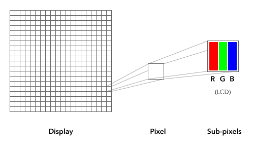
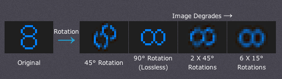
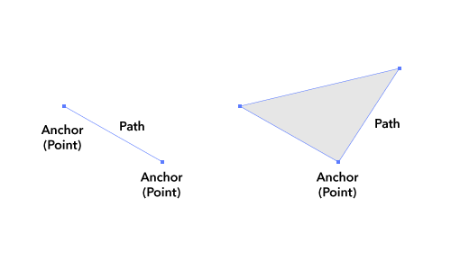
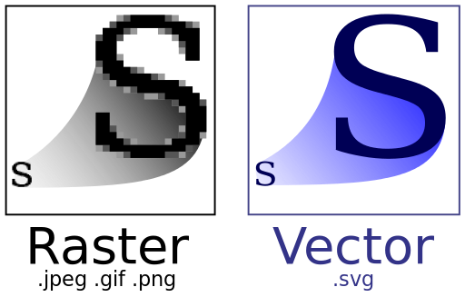
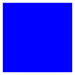
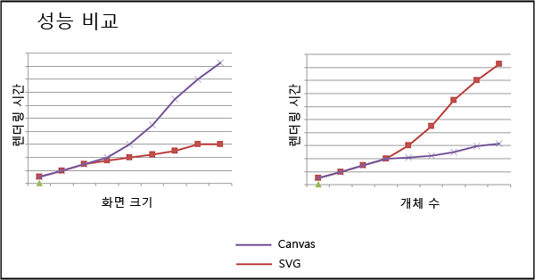
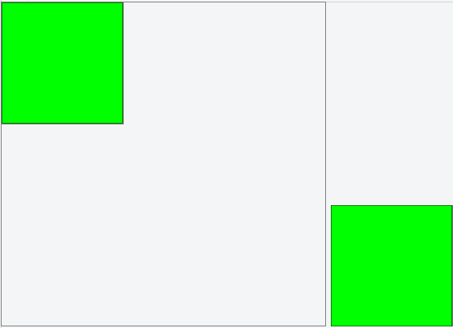
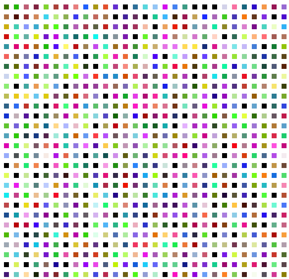

# SVG와 Canvas

### 비트맵 방식 과 벡터 방식

일단 컴퓨터 그래픽은 크게 비트맵(Bitmap)과 벡터(Vector)방식으로 구분된다.

#### 비트맵(Bitmap)

비트맵은 "비트의 지도(map of bits)"란 듯으로, 각 픽셀에 저장된 일련의 비트 정보 집합이라고 보면 된다. 디스플레이는 픽셀들의 배열로 구성되어 있다. 픽셀들의 배열 방식, 픽셀들의 총 숫자나 가로 세로의 비율이 그 디스플레이의 해상도를 결정짓는다. 예를들어 1920 x 1080의 해상도를 가진 디스플레이는 가로 1920개, 세로 1080개의 픽셀들을 가진 다는 것을 의미한다. 가로와 세로의 값을 곱하면 그 디스플레이가 가진 총 픽셀 수가 된다.



하나의 픽셀은 R(빨강), G(초록), B(파랑)의 세 가지의 서브 픽셀(subpixel)로 이루어져 있다. 또한 비트맵은 다른 표현으로 픽스맵(pixmap)이나 래스터(raster) 이미지로도 불린다.

##### 장점

비트맵은 최하위의 레벨에서 렌더링 된 고정된 형식의 이미지 포맷으로, 컴퓨터에서 해당 형식의 파일을 연산하는데 많은 효율성을 지니고 있다. 같은 형태의 벡터 포맷 그래픽이라면 컴퓨터에서 더 많은 연산을 수행하게 되어 하드웨어에 부담을 준다.

##### 단점



비트맵은 최종적으로 렌더링 된 상태의 포맷이기 때문에 이미지 편집이 자유롭지 못 하며, 해상도가 고정되어 있기에 업-스케일(up-scale)을 하면 퀄리티에 큰 훼손이 가며, 다운-스케일(down-scale)이나 회전 등의 변형 시에도 안티-앨리어싱 작업이 중복으로 적용되게 되어 이미지 퀄리티에 큰 손상이 간다.

#### 벡터(Vector)

벡터 방식은 비트맵과는 반대로 표현되는 그래픽의 형태(shape)들이 수학적 공식으로 이루어져 있다. 다시말해 벡터 방식의 그래픽은 고정된 비트맵을 가지고 있는 것이 아니라, 수학적 공식으로 이루어진 오브젝트들이 그때그때 디스플레이에 비트맵화 되어 스크린에 표시된다.



벡터 방식의 그래픽은 다음과 같은 메커니즘으로 구성된다. 일단 두 개의 점이 연결되면 하나의 선이 되고 그 선이 세 개 이상이 되면 면을 만들 수 있다. 그리고 각각의 선은 두께 값과 색상 값, 곡률 값을, 면은 색상 값을 가질 수 있다. 이렇게 점과 선, 면의 기본적 벡터 그래픽 요소들이 모여 다양하고 복잡한 벡터 그래픽을 만들 수 있게 된다.

##### 장점



벡터 그래픽은 점과, 점으로 이루어진 선, 면으로 모든 그래픽 요소들이 이루어져 있기에, 간단하게 점과 선을 수정하는 과정으로 이미지 편집이 자유롭다. 즉, 벡터 포맷의 작업 파일이 보존되는 한 자유로운 수정이 가능하다. 또한 작업된 벡터 그래픽을 바탕으로 언제든지 다양한 방식, 그리고 원하는 해상도의 비트맵 포맷으로 산출이 가능하다.

##### 단점

비트맵 방식에 비해 컴퓨터에서 더 많은 연산을 수행하게 되어 하드웨어에 부담을 준다.

### SVG

확장가능한 벡터 그래픽 (SVG)은 2차원의 벡터 그래픽을 기술하기 위한 XML 마크업 언어이며, 메모리 내에서 유지되므로 다시 렌더링할 때 코드 결과를 통해 조작할 수 있는 유지 모드 그래픽 모델이다.

SVG는 Adobe사가 소유한 Flash 기술과 유사하지만,  W3C 권고라는 점에서 Flash 기술과는 차별된다(즉, 표준이다). 그리고 플래시가 폐쇄적인 바이너리 형식인 데 반해 SVG는 XML 기반 포맷이다. 이는 CSS, DOM, SMIL과 같은 다른 W3C 표준들과 함께 작업하는 것을 고려해서 설계되었다는 것을 보여준다.

HTML과 마찬가지로 SVG는 요소, 특성 및 스타일을 사용하여 문서에 빌드된다. ``<svg>`` 요소가 처음 문서에 도입되면 이 요소는 ``<div>``처럼 동작하고 ``HTMLDocument``에 속하지만 추가적인 인터페이스인 ``SVGDocument``를 포함한다. ``SVGDocument``는 벡터 그래픽과의 더 긴밀하고 더 풍부한 상호 작용을 제공한다.

```xml
<svg height="1000px" width="1000px">
  <rect id="myRect" height="100px" width="100px" fill="blue"/>
</svg>
```



* [sample](http://go.microsoft.com/fwlink/p/?LinkId=217041)

### Canvas

Canvas는 Apple for Safari 및 기타 그래픽 widget에 의해 HTML5에 도입된 ``<canvas>`` 태그가 제공하는 풍부한 사용자 그래픽 환경을 제공하는 또 다른 방법이다. Canvas는 SVG처럼 직사각형, 경로 및 이미지를 비롯한 즉시 모드 그래픽을 그리기 위한 더 많은 프로그래밍 환경을 노출한다. 즉시 모드 그래픽 렌더링은 그래픽을 화면에 직접 렌더링한 다음 그 후에는 수행된 작업에 대한 컨텍스트가 없는 실행 후 자동모델이다.

유지 모드와 달리 렌더링된 그래픽이 저장되지 않기 때문에 개발자는 실질적으로 화면이 변경되는지와는 상관없이 새 프레임이 필요할 때마다 전체 장면을 설명하는 데 필요한 모든 그리기 명령을 다시 호출해야 한다.

```xml
<canvas id="myCanvas" width="1200px" height="1200px"></canvas>
```

```javascript
var canvas = document.getElementById("myCanvas");
var ctx = canvas.getContext("2d");

ctx.fillStyle = "rgb(0,0,255)";
ctx.fillRect(10, 10, 100, 100);
```


* [sample](http://go.microsoft.com/fwlink/p/?LinkId=215949)

### SVG vs. Canvas

| Canvas | SVG |
| ------ | --- |
| 픽셀 기반 | 벡터 기반 |
| 단일 HTML 요소 | DOM의 부분이 되는 다중 그래픽 요소 |
| 스크립트를 통해서만 수정됨 | 스크립트 및 CSS를 통해 수정됨 |
| 이벤트 모델/사용자 조작이 세분화됨(x,y) | 이벤트 모델/사용자 조작이 추상화됨(직사각형, 경로) |
| 성능은 표면이 작거나, 개체 수가 많을 경우(>10k) 또는 두 가지 조건이 모두 충족되면 개선됨 | 성능은 개체 수가 작거나(>10k), 표면이 클 경우 또는 두 가지 조건이 모두 충족되면 개선됨 |
| 고성능(필터, 광선추적), 복잡한 장면, 실시간 수학 애니메이션, 동영상 조작 | 보기 및 인쇄용 고품질 문서, 정적 이미지 |



일반적으로 화면 크기가 커질수록 그리는 데 더 많은 픽셀이 필요하므로 Canvas는 성능이 떨어지기 시작한다. 반면, SVG는 화면의 개체 수가 증가하면 지속적으로 개체를 DOM에 추가하므로 성능이 떨어지기 시작한다. 이러한 측정이 반드시 정확한 것은 아니며 분명히 구현과 플랫폼, 완전한 하드웨어 가속 그래픽 사용 여부 및 JavaScript 엔진 속도에 따라 변경될 수 있다.

### 래스터라이즈(Raterize)

벡터 그래픽 이미지를 래스터 이미지로 변환하는 것을 의미한다.

```xml
<canvas id="canvas1" width="400" height="400"></canvas>

<svg id="mySVG" xmlns="http://www.w3.org/2000/svg" version="1.1">
  <rect width="150" height="150" fill="rgb(0, 255, 0)" stroke-width="1" stroke="rgb(0, 0, 0)"/>
</svg>
```

```javascript
var can = document.getElementById('canvas1');
var ctx = can.getContext('2d');

//var svg = document.getElementById('mySVG');

var img = new Image();
img.onload = function() {
ctx.drawImage(img, 0, 0);
}
img.src = "http://upload.wikimedia.org/wikipedia/commons/d/d2/Svg_example_square.svg";
```



* [sample](http://jsfiddle.net/Na6X5/)

### Example



62500개의 box를 생성하여 SVG와 Canvas를 비교할 수 있는 예제이다.

* [example](https://embed.plnkr.co/k6eheDqYq48KNKC23lka/)


### 참조

* [Canvas - MDN](https://developer.mozilla.org/ko/docs/Web/HTML/Canvas)
* [SVG - MDN](https://developer.mozilla.org/ko/docs/Web/SVG)
* [SVG 대 캔버스: 선택 방법](https://msdn.microsoft.com/ko-kr/library/gg193983.aspx)
* [비트맵 방식과 벡터 방식](https://spoqa.github.io/2012/06/13/bitmap-vector.html)
* [래스터화 - 위키백과](https://ko.wikipedia.org/wiki/%EB%9E%98%EC%8A%A4%ED%84%B0%ED%99%94)