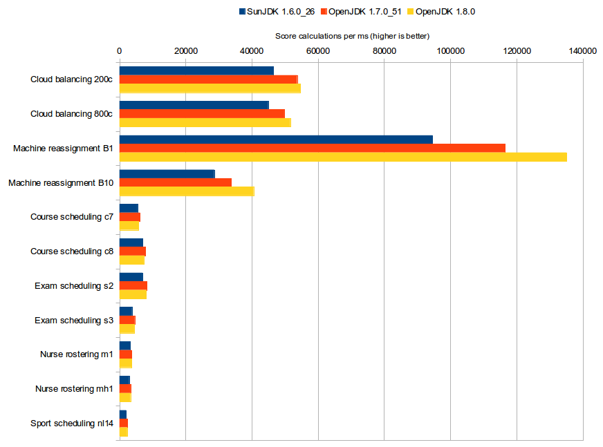
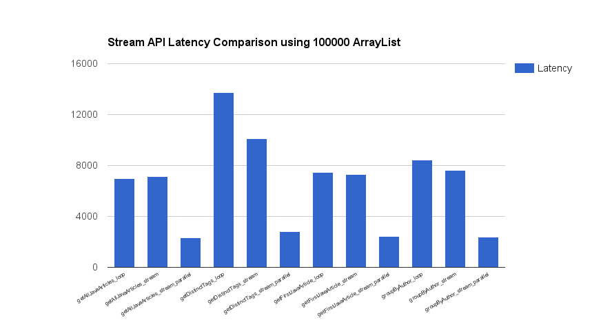

# Java 8

## 이전 버전과 차이점

### 인터페이스의 개선

Java Interface는 ``abstract methods``, ``default methods``, ``static methods`` 를 정의할 수 있다.

> The interface body can contain abstract methods, default methods, and static methods.

* [Defining an Interface - Oracle](http://docs.oracle.com/javase/tutorial/java/IandI/interfaceDef.html)
* [Evolving Interfaces - Oracle](http://docs.oracle.com/javase/tutorial/java/IandI/nogrow.html)
* [Java 8 Interface Changes – static method, default method](http://www.journaldev.com/2752/java-8-interface-changes-static-method-default-method)

#### 인터페이스에 static 메소드를 정의 가능

이는 라이브러리에 ``helper method``들을 구성하는데 더 쉽게 해주며, 별도의 클래스를 생성하지 않고도 같은 인터페이스에 둠으로써 ``static method`` 명확하게 유지해준다.

> This makes it easier for you to organize helper methods in your libraries; you can keep static methods specific to an interface in the same interface rather than in a separate class.

* [Static Methods - Oracle](http://docs.oracle.com/javase/tutorial/java/IandI/defaultmethods.html#static)

```java
public static <T extends Comparable<? super T>> Comparator<T> naturalOrder() {
	return (Comparator<T>) Comparators.NaturalOrderComparator.INSTANCE;
}
```

* [Comparator (Java Platform SE 7 ) - Oracle](https://docs.oracle.com/javase/7/docs/api/java/util/Comparator.html)
* [Comparator (Java Platform SE 8 ) - Oracle](https://docs.oracle.com/javase/8/docs/api/java/util/Comparator.html)

#### 인터페이스에 default 메소드를 정의 가능

이는 인터페이스를 구현하는 기존 코드의 변경없이 새 메소드의 추가가 가능하게 해준다. (단, 예외적으로 Object클래스의 메소드에 대해서 default구현은 정의 할 수 없다.)

> Default methods enable you to add new functionality to the interfaces of your libraries and ensure binary compatibility with code written for older versions of those interfaces.

* [Default Methods - Oracle](http://docs.oracle.com/javase/tutorial/java/IandI/defaultmethods.html)
* [Java8: Why is it forbidden to define a default method for a method from java.lang.Object](http://stackoverflow.com/questions/24016962/java8-why-is-it-forbidden-to-define-a-default-method-for-a-method-from-java-lan)

```java
public default void forEach(Consumer<? super T> action) {
    Objects.requireNonNull(action);
    for (T t : this) {
        action.accept(t);
    }
}
```
* [Iterator (Java Platform SE 7 ) - Oracle](https://docs.oracle.com/javase/7/docs/api/java/util/Iterator.html)
* [Iterator (Java Platform SE 8 ) - Oracle](https://docs.oracle.com/javase/8/docs/api/java/util/Iterator.html#forEachRemaining-java.util.function.Consumer-)
* [Default Methods in Java 8 and Multiple Inheritance](http://www.programcreek.com/2014/12/default-methods-in-java-8-and-multiple-inheritance/)

#### 함수형 인터페이스

``functional interface``는 단 하나의 추상 메소드가 정의 가능한 인터페이스이다. 인터페이스가 함수형 인터페이스임을 나타내는 수단으로서 ``FunctionalInterface`` 어노테이션이 도입되었다.

(단, 어노테이션을 통해 명시적으로 지정하지 않더라도 함수 인터페이스의 정의를 만족하는 인터페이스라면 자바 컴파일러가 주석의 유무에 상관없이 함수 인터페이스로서 취급한다.)

> An informative annotation type used to indicate that an interface type declaration is intended to be a functional interface as defined by the Java Language Specification. Conceptually, a functional interface has exactly one abstract method.

* [Annotation Type FunctionalInterface](https://docs.oracle.com/javase/8/docs/api/java/lang/FunctionalInterface.html)

```java
@FunctionalInterface
public interface Runnable {
    public abstract void run();
}
```

* [Runnable (Java Platform SE 7 ) - Oracle](https://docs.oracle.com/javase/7/docs/api/java/lang/Runnable.html)
* [Runnable (Java Platform SE 8 ) - Oracle](https://docs.oracle.com/javase/8/docs/api/java/lang/Runnable.html)
* [java.util.function (Java Platform SE 8 ) - Oracle](https://docs.oracle.com/javase/8/docs/api/java/util/function/package-summary.html)

### 람다식(Lambda Expression)

프로그래밍 언어에서 사용되는 개념으로 익명 함수(Anonymous functions)를 지칭하는 용어이다.

> lambda expression in computer programming, also called anonymous function, a function (or a subroutine) defined, and possibly called, without being bound to an identifier

* [Lambda expression](https://en.wikipedia.org/wiki/Lambda_expression)
* [Lambda Expressions - The Java™ Tutorials](http://docs.oracle.com/javase/tutorial/java/javaOO/lambdaexpressions.html)
* [java 8 람다식 소개와 의미 고찰 - Slide Share](http://www.slideshare.net/gyumee/java-8-lambda-35352385)

#### 람다식 문법

* (인자 목록) -> { 구문 }

``User`` 객체의 리스트를 ``id`` 프로퍼티에 따라 역순으로 정렬하는 코드이며, 역순으로 정렬하려고 ``Comparator`` 인터페이스를 익명 클래스로 구현해 전달했다.

```java
Collections.sort(userList, new Comparator<User>() {
    public int compare(User a, User b) {
        return b.getId() - a.getId();	// 실제 필요한 코드
    }
});
```

람다를 사용하면 이를 더 간단히 표현할 수 있다. 아래 코드를 보면 꼭 필요한 부분만 남아 있음을 볼 수 있다.

```java
userList.sort((User a, User b) -> {
    return b.getId() - a.getId();	// 실제 필요한 코드
});
```

대상 타입 추론, 매개변수 타입 추론 등을 이용하면, 아래 코드와 같이 더 간략하게 표현할 수 있다.

```java
userList.sort((a, b) -> a.getId() - b.getId());
```

#### 람다식 예

```java
() -> {}                     // No parameters; result is void
() -> 42                     // No parameters, expression body
() -> null                   // No parameters, expression body
() -> { return 42; }         // No parameters, block body with return
() -> { System.gc(); }       // No parameters, void block body
() -> {
  if (true) return 12;
  else {
    int result = 15;
    for (int i = 1; i < 10; i++)
      result *= i;
    return result;
  }
}                          // Complex block body with returns
(int x) -> x+1             // Single declared-type parameter
(int x) -> { return x+1; } // Single declared-type parameter
(x) -> x+1                 // Single inferred-type parameter
x -> x+1                   // Parens optional for single inferred-type case
(String s) -> s.length()   // Single declared-type parameter
(Thread t) -> { t.start(); } // Single declared-type parameter
s -> s.length()              // Single inferred-type parameter
t -> { t.start(); }          // Single inferred-type parameter
(int x, int y) -> x+y      // Multiple declared-type parameters
(x,y) -> x+y               // Multiple inferred-type parameters
(final int x) -> x+1       // Modified declared-type parameter
(x, final y) -> x+y        // Illegal: can't modify inferred-type parameters
(x, int y) -> x+y          // Illegal: can't mix inferred and declared types
```

### 스트림(Stream) API

* 스트림이란 한 번에 한 개씩 만들어지는 연속적인 데이터 항목들의 모임
* Stream 인터페이스는 컬랙션(Collection)을 다루는 새로운 방법을 제공
* 스트림은 컬랙션을 파이프식으로 처리하도록 하면서 고차함수로 그 구조를 추상화
* 지연 연산이나 병렬 처리 등이 동일 인터페이스로 제공

#### 스트림의 특징

* No storage – 데이터 보관을 위해 별도로 공간을 마련하지 않음
* Immutable – 기본적으로는 원본을 조작하지 않음
* Laziness – 최종적인 결과를 얻을 때 필요한 동작만을 수행
* Possibly unbounded – 값을 무한히 가질수도 있음
* Consumable – 스트림은 각 원소들을 단 한번만 방문 (1회성)


* [java.util.stream (Java Platform SE 8 ) - Oracle](https://docs.oracle.com/javase/8/docs/api/java/util/stream/package-summary.html)
* [Java 8 스트림의 병렬/직렬 처리 속도 비교](https://purluno.wordpress.com/2014/09/21/java-8-%EC%8A%A4%ED%8A%B8%EB%A6%BC%EC%9D%98-%EB%B3%91%EB%A0%AC%EC%A7%81%EB%A0%AC-%EC%B2%98%EB%A6%AC-%EC%86%8D%EB%8F%84-%EB%B9%84%EA%B5%90/)
* [자바8 Stream API 주의사항](http://leeyongjin.tistory.com/entry/Java8-%EC%9E%90%EB%B0%948-Stream-API-%EC%A3%BC%EC%9D%98%EC%82%AC%ED%95%AD)

#### 스트림 예

```
1 : 2 : 3 : ... : 10
```

```java
	/* Java 7 버전 */
    final StringBuilder stringBuilder = new StringBuilder();
    final String separator = " : ";
    for (final Integer number : numbers) {
      stringBuilder.append(number).append(separator);
    }
    final int stringLength = stringBuilder.length();
    if (stringLength > 0) {
      stringBuilder.delete(stringLength - separator.length(), stringLength);
    }
    System.out.println(stringBuilder.toString());

    /* Java 8 버전 */
    final String result = numbers.stream()
                                 .map(String::valueOf)
                                 .collect(joining(" : "));
    System.out.println(result);
```

* [모던 자바 (자바 8) - 못다한 이야기](https://www.youtube.com/playlist?list=PLRIMoAKN8c6O8_VHOyBOhzBCeN7ShyJ27)

#### 병렬처리

```java
// 순차 처리 스트림
int sum = widgets.stream()
                 .filter(b -> b.getColor() == RED)
                 .mapToInt(b -> b.getWeight())
                 .sum();

// 병렬 처리 스트림
int sum = widgets.parallelStream()
                 .filter(b -> b.getColor() == RED)
                 .mapToInt(b -> b.getWeight())
                 .sum();

// aParallelStream.sequential() <-> aSeqStream.parallel()
```

* [java.util.stream (Java Platform SE 8 ) - Oracle](https://docs.oracle.com/javase/8/docs/api/java/util/stream/package-summary.html)


#### 반복의 내제화

##### Collection

```java
// 외부 반복
for(int n: numbers) {
	...
}
```

* 명시적 외부 반복
* 제어 흐름의 중복 발생
* 효율적이고 직접적인 요소 처리
* 지저분한 코드
* 유한 데이터 구조 API

##### Stream

```java
// 내부 반복
numbers.forEach(n -> ...)
```

* 반복 구조의 캡슐화
* 제어 흐름 추상화
* 파이프-필터 기반 API
* 최적화와 알고리즘 분리
* 함축적인 표현
* 무한 연속 데이터 흐름 API
* 데이터 외 I/O, 값 생성 등 적용


* [Beyond Java: 자바 8을 중심으로 본 자바의 혁신](http://www.slideshare.net/gyumee/beyond-java-8)

### Collection API의 확장

인터페이스가 default 메소드를 가질 수 있게 됨으로써 자바8의 Collection API에는 다수의 메소드가 새롭게 추가되었다. 인터페이스는 모두 default 메소드가 구현되었다.

* Iterable.forEach(Consumer)
* Iterator.forEachRemaining(Consumer)
* Collection.removeIf(Predicate)
* Collection.spliterator()
* Collection.stream()
* Collection.parallelStream()
* List.sort(Comparator)
* List.replaceAll(UnaryOperator)
* Map.forEach(BiConsumer)
* Map.replaceAll(BiFunction)
* Map.putIfAbsent(K, V)
* Map.remove(Object, Object)
* Map.replace(K, V, V)
* Map.replace(K, V)
* Map.computeIfAbsent(K, Function)
* Map.computeIfPresent(K, BiFunction)
* Map.compute(K, BiFunction)
* Map.merge(K, V, BiFunction)
* Map.getOrDefault(Object, V)

### Joda Time 방식의 새 날짜 API 변경 (JSR 310)

JDK 8에는 JSR-310이라는 표준 명세로 날짜와 시간에 대한 새로운 API가 추가되었다.Joda-Time에 가장 많은 영향을 받았고, 그 밖에 Time and Money 라이브러리나 ICU 등 여러 오픈소스 라이브러리를 참고했다고 한다.

* [Java의 날짜와 시간 API - D2 Hello world](http://d2.naver.com/helloworld/645609)

#### JDK의 기본 날짜 클래스의 문제점

* 불변 객체가 아니다(not immutable)
```java
public Date getDate() {
	return this.date;
    // return new Date(this.date.getTime()); // 방어복사
}
```

* int 상수 필드의 남용
```java
calendar.add(Calendar.SECOND, 2);
calendar.add(Calendar.JUNE, 2); // 잘못된 상수 입력에도 컴파일 오류가 발생하지 않는다.
```

* 헷갈리는 월 지정
```java
calendar.set(1582, Calendar.OCTOBER , 4); // Calendar.OCTOBER : 9
calendar.set(1582, 10 - 1 , 4);
calendar.set(1582, 10 , 4); // 실수로 입력하기 쉽다.
calendar.set(1999, 12, 31); // 13월, 오류가 발생하지 않는다.
```

* 일관성 없는 요일 상수
```java
int dayOfWeek = calendar.get(Calendar.DAY_OF_WEEK);
    assertThat(dayOfWeek).isEqualTo(Calendar.WEDNESDAY);
    assertThat(dayOfWeek).isEqualTo(4); // 일요일 : 1
    Date theDate = calendar.getTime();
    assertThat(theDate.getDay()).isEqualTo(3); // 일요일 : 0
```

* 오류에 둔감한 시간대 ID지정
```java
TimeZone zone = TimeZone.getTimeZone("Seoul/Asia"); // "Asia/Seoul"을 잘 못 적었지만, 오류가 발생하지 않는다.
```

* java.util.Date 하위 클래스의 문제
 * java.sql.Date 클래스는 상위 클래스인 java.util.Date 클래스와 이름이 동일
 * java.sql.TimeStamp 클래스는 equals() 선언의 대칭성을 어김(a.equals(b) : true,  b.equals(a) : false)


#### 변경 및 추가된 점

* 클래스는 immutable이며 스레드에 대해 안전
* 월의 int 값과 명칭이 일치 (1월의 int 값은 1)
* 13월 같이 잘못 된 월이 넘어가면 객체 생성 시점에서 ``IllegalFieldValueException``을 발생
* 요일 상수는 일관되게 사용
* 잘못 된 시간대 ID 지정에는 ``IllegalArguementException``을 던짐
* 날짜 및 시간 형식으로  ``Instant``, ``LocalDate``, ``LocalDateTime``, ``ZonedDateTime``이 추가
* 날짜와 시간 이외의 것으로서 ``Duration``과 ``Period``가 추가
* ``Month``, ``DayOfWeek``, ``Year``, ``Month YearMonth``, MonthDay, OffsetTime, OffsetDateTime등의 값 형식 추가
* 날짜/시간 클래스는 대부분이 JDBC에서 지원됨으로서 RDB연동의 효율적인 구현이 가능

* [Java SE 8 Date and Time - Oracle](http://www.oracle.com/technetwork/articles/java/jf14-date-time-2125367.html)
* [Trail: Date Time: Table of Contents - Oracle](http://docs.oracle.com/javase/tutorial/datetime/TOC.html)

### 메타 데이터 지원 보완

#### 자바 타입 어노테이션(JSR 308)

자바 8에서는 어노테이션을 달 수 있는 대상이 대폭 넓어졌는데 그중에 타입도 해당한다. 여러 타입을 지정하는 곳에 어노테이션을 달아서 자바의 기본 타입 시스템이 제공하지 않는 정보를 추가할 수 있게 되었다.

```java
Forecast currentForecast = new @Interned Forecast(); // Generation of new objects

@NonEmpty Forecast [] // Generics and arrays

@Readonly Object x; …
 (@Readonly Date) x … // Type casting.

Object myObject = (@NotNull Object) obj // Type casting.

class MyForecast<T> implements @NonEmpty List< @ReadOnly T> // Inheritance

catch (@Critical Exception e) { // Exceptions
 ...
}

class Weather {
    ...
    void tempCalc(@ReadOnly Weather this){} // Receivers
    ...
}

```

* [JSR 308 Explained: Java Type Annotations - Oracle](http://www.oracle.com/technetwork/articles/java/ma14-architect-annotations-2177655.html)

#### 어노테이션 중복 지정

단일 언어 요소에 동일 어노테이션을 하나 이상 지정할 수 없는 제약이 풀렸다. 아래와 같은 두 과정을 거치면 어노테이션을 중복 지정할 수 있다.

```java
// Step 1 : Declare a Repeatable Annotation Type
import java.lang.annotation.Repeatable;

@Repeatable(Schedules.class)
public @interface Schedule {
  String dayOfMonth() default "first";
  String dayOfWeek() default "Mon";
  int hour() default 12;
}

// Step 2 : Declare the Containing Annotation Type
public @interface Schedules {
    Schedule[] value();
}
```

```java
@Schedule(dayOfMonth="last")
@Schedule(dayOfWeek="Fri", hour="23")
public void doPeriodicCleanup() { ... }
```

* [Repeating Annotations - Oracle](http://docs.oracle.com/javase/tutorial/java/annotations/repeating.html)

#### 매개변수 메타데이터 리플랙션 지원

메서드의 매개변수와 외부 값을 사상하는 경우 어노테이션에 일일이 대응하는 값의 이름을 지정했어야 했지만 자바 8에서는 다음과 같이 생략이 가능하다.

```java
// before java 8
public String foo(@RequestParam("name") String name, @RequestParam("file") MultipartFile file) { ... }

// after java 8
public String foo(@RequestParam String name, @RequestParam MultipartFile file) { ... }
```

* [Obtaining Names of Method Parameters - Oracle](http://docs.oracle.com/javase/tutorial/reflect/member/methodparameterreflection.html)

### 동시성 API 개선

* ``ConcurrentHaspMap``에 새로운 메서드를 추가해 사용성을 개선(forEach methods, search methods, reduction methods)
* 계수나 누산 같은 작업을 원자적으로 할 수 있도록 돕는 클래스가 ``java.util.concurrent.atomic``에 추가(DoubleAccumulator, DoubleAdder, LongAccumulator, LongAdder)
* commonPool()이란 정적 메서드가 추가되어 특별히 ``ForkJoinPool``을 따로 생성하지 않고 공통으로 사용하는 ``ForkJoinPool``을 얻을 수 있게됨(getCommonPoolParallelism(), commonPool())
* 기존 ``ReadWriteLock``을 개선한 ``StampledLock``을 새로 작성


* [Concurrency Utilities Enhancements in Java SE 8
](http://docs.oracle.com/javase/8/docs/technotes/guides/concurrency/changes8.html)
* [ConcurrentHashMap (Java Platform SE 7 ) - Oracle](http://docs.oracle.com/javase/7/docs/api/java/util/concurrent/ConcurrentHashMap.html)
* [ConcurrentHashMap (Java Platform SE 8 ) - Oracle](http://docs.oracle.com/javase/8/docs/api/java/util/concurrent/ConcurrentHashMap.html)
* [java.util.concurrent.atomic (Java Platform SE 7 ) - Oracle](https://docs.oracle.com/javase/7/docs/api/java/util/concurrent/atomic/package-summary.html)
* [java.util.concurrent.atomic (Java Platform SE 8 ) - Oracle](https://docs.oracle.com/javase/8/docs/api/java/util/concurrent/atomic/package-summary.html)
* [ForkJoinPool (Java Platform SE 7 ) - Oracle](http://docs.oracle.com/javase/7/docs/api/java/util/concurrent/ForkJoinPool.html)
* [ForkJoinPool (Java Platform SE 8 ) - Oracle](http://docs.oracle.com/javase/8/docs/api/java/util/concurrent/ForkJoinPool.html)
* [ReadWriteLock (Java Platform SE 7 ) - Oracle](https://docs.oracle.com/javase/7/docs/api/java/util/concurrent/locks/ReadWriteLock.html)
* [StampedLock (Java Platform SE 8 ) - Oracle](https://docs.oracle.com/javase/8/docs/api/?java/util/concurrent/locks/StampedLock.html)

### IO/NIO 확장

* IO/NIO에 새로운 메소드가 추가되어 파일이나 입력 스트림에서 ``java.util.stream.Stream``을 직접 생성이 가능

```java
public static Stream<Path> list(Path dir) throws IOException

Files.list(new File(".").toPath())
     .forEach(System.out::println);

Files.walk(new File(".").toPath())
     .filter(p -> !p.getFileName()
                    .toString().startsWith("."))
     .forEach(System.out::println);
```

* ``RuntimeException을`` 확장한 ``IOException``인 새로운 클래스의 ``UncheckedIOException`` 추가
* 클로징 가능한 ``CloseableStream``이 추가


* [Java 8 Friday Goodies: The New New I/O APIs](https://blog.jooq.org/2014/01/24/java-8-friday-goodies-the-new-new-io-apis/)
* [Files (Java Platform SE 7 ) - Oracle](https://docs.oracle.com/javase/7/docs/api/java/nio/file/Files.html)
* [Files (Java Platform SE 8 ) - Oracle](https://docs.oracle.com/javase/8/docs/api/java/nio/file/Files.html)
* [UncheckedIOException (Java Platform SE 8 ) - Oracle](https://docs.oracle.com/javase/8/docs/api/java/io/UncheckedIOException.html)
* [CloseableStream (Java Platform SE 8 b00) - Oracle](http://download.java.net/lambda/b79/docs/api/java/util/stream/CloseableStream.html)

### 나즈혼(Nashorn) 자바스크립트 엔진

* Nashorn은 새로 JDK에 통합된 경량 고성능 JavaScript구현 엔진
* Rhino의 후속이며, 성능과 메모리 관리가 개선
* javax.script API를 지원
* DOM/CSS와 브라우저 플러그인API는 포함되지 않음

* [Rhino documentation - MDN](https://developer.mozilla.org/en-US/docs/Mozilla/Projects/Rhino/Documentation)
* [Nashorn User's Guide - Oracle](https://docs.oracle.com/javase/8/docs/technotes/guides/scripting/nashorn/)

## 성능

### Benchmark

* Java6 -> Java7 : 평균 16% 성능향상
* Java7 -> Java8 : 평균 1% 성능향상



* [How much faster is Java 8?](http://www.optaplanner.org/blog/2014/03/20/HowMuchFasterIsJava8.html)

### Stream API Benchmark

* 10만개의 Article로 테스트
* 기본 for loop
* stream API 사용
* stream API를 parallel 옵션으로 사용



* [자바8 스트림 API 성능 벤치마킹](http://www.kwangsiklee.com/2016/01/%EC%9E%90%EB%B0%948-%EC%8A%A4%ED%8A%B8%EB%A6%BC-api-%EC%84%B1%EB%8A%A5-%EB%B2%A4%EC%B9%98%EB%A7%88%ED%82%B9/)

## 참고

* [What's New in JDK 8](http://www.oracle.com/technetwork/java/javase/8-whats-new-2157071.html)
* [JDK 8 Features](http://openjdk.java.net/projects/jdk8/features)
* [Java 8 개선 사항 관련 글 모음](http://blog.fupfin.com/?p=27)
* [자바 8 살펴보기](http://www.moreagile.net/2014/04/AllAboutJava8.html)
* [Beyond Java: 자바 8을 중심으로 본 자바의 혁신](http://www.slideshare.net/gyumee/beyond-java-8)
* [java 8 람다식 소개와 의미 고찰 - Slide Share](http://www.slideshare.net/gyumee/java-8-lambda-35352385)
* [모던 자바 (자바 8) - 못다한 이야기](https://www.youtube.com/playlist?list=PLRIMoAKN8c6O8_VHOyBOhzBCeN7ShyJ27)
