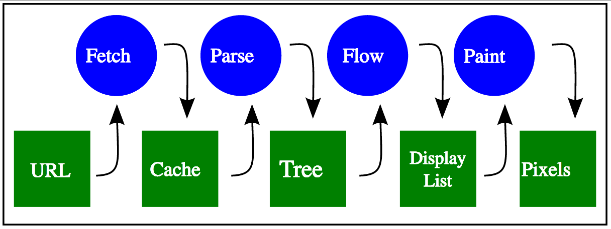
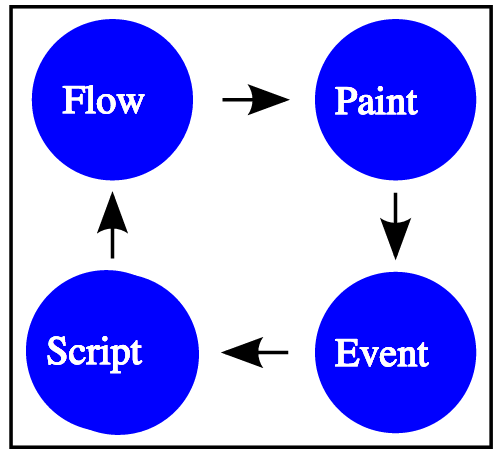

# 이벤트 및 이벤트 핸들링에 대한 개요

## 이벤트와 이벤트 핸들링

웹 페이지에서는 어떤 종류의 상호작용이 발생할 때 이벤트가 일어난다. 이벤트와 이벤트 핸들링은 웹 페이지가 사용자에 의해 열린 상태를 유지하는 동안 일어나는 상호작용에 대한 반응을 구현하기 위한 자바스크립트의 핵심적인 기술이다.

### 상호작용의 종류

* 페이지가 전시(display)되기 위한 준비과정 중 일어나는 상호작용
* 웹 페이지상의 컨텐츠와 사용자의 상호작용에 의한 상호작용
* 브라우저가 실행되는 기반 장치와 관련된 상호작용
* 매체 스트림(media stream) 재생이나 애니메이션 시간 간격 등 기타 요인에 의한 상호작용

## 이벤트가 움직이는 방법

웹 페이지 내의 HTML 요소에서 이벤트가 일어나게 되면, 그 요소는 이벤트에 대해 어떤 이벤트 핸들러가 할당되어 있는지 찾아보게 된다. 할당된 이벤트 핸들러가 있다면 적합한 방법으로 그것을 호출하게 되는데, 참조값과 일어난 이벤트에 대한 추가적인 정보들을 함께 전송한다. 그러면 이벤트 핸들러가 동작하게 된다.

## 브라우저의 렌더링 아키텍처

이벤트와 이벤트 핸들링과 함께 브라우저의 렌더링 아키텍처 역시 단일 처리경로 페이지 렌더링으로부터 리플로우 기반 이벤트 구동식 페이지 렌더링 개념으로 바뀌었다.

### 단일 처리경로 페이지 렌더링 (최초 브라우저)

브라우저는 페이지의 모든 부분에 대한 문법분석(parse), 처리(process), 그리기(draw) 및 사용자에게 표현(present)까지의 모든 과정이 끝날 때까지 대기하고, 페이지 작업이 끝나면 그 상태로 바뀌지 않고 새 페이지 요청이 있어서 가져오기(fetch)작업이 일어나기 전까지는 그대로의 모습을 유지한다.



### 리플로우 기반 이벤트 구동식 페이지 렌더링

브라우저는 처리, 그리기, 컨텐츠 표현(present), 반복순환작업을 다시 개시하도록 하는 이벤트 트리거에 대한 대기 등의 작업을 반복순환(loop)하여 수행한다. 이 이벤트 트리거라는 것은 이벤트를 발생하게 하는 사건을 이르는 것으로서, 네트워크상의 자원 로드 완료(예 : 이미지가 다운로드되어 화면상에 그릴 수 있게 됨), 브라우저에 의한 자원의 문법분석 완료(예 : HTML페이지 처리가 끝남) 페이지의 컨텐츠와 사용자와의 상호작용(예 : 버튼을 클릭한다) 등이 이러한 사건이 될 수 있다.

그리기 작업이 끝나면 새로운 이벤트 발생에 대한 처리(이벤트 핸들링)를 하기 위해 이벤트를 기다리게 된다. 이 혁신적인 개념을 이용하면 자원을 다 획득하지 않았더라도 페이지를 부분적으로 렌더링하는 것이 가능하다.



## 이벤트 설계 패턴

이벤트 시스템은 근본적으로는 이벤트의 종류와 아래 사항에 대해 합의된 약속을 기반으로 한 단순한 프로그래밍 설계 패턴이다. 최신 웹 브라우저는 이 이벤트 패턴을 표준화된 방식으로 구현한다. 브라우저는 어떤 이벤트의 프로퍼티를 나타내는 자료 구조로서  ``EventPrototype`` 객체를 원천으로 하는 어떤 객체를 사용한다. 또한 이러한 자료구조를 핸들링할 함수에 대한 등록 메소드로서 ``addEventListener`` 메소드를 사용하는데 이것은 인수로서 이벤트명과 핸들러 함수를 받는다. 마지막으로 브라우저는 이벤트 발동자(emitter)로 수많은 객체를 정의하며 또한 이 객체들에 의해 생성되는 여러 이벤트형(event type)을 정의한다.

* 각 이벤트를 가리키는 이벤트명 문자열
* 각 이벤트의 핵심 프로퍼티를 나타내기 위한 자료구조의 형식
* 각 이벤트를 발동할 자바스크립트 객체

### 이벤트 호출 타입

#### 캡춰링(capturing)

이벤트 캡춰링은 DOM 트리의 가장 바깥 요소에서부터 시작하여, 이벤트가 일어난 요소에 도착할 때까지 안쪽으로 찾아 들어가고, 다시 바깥으로 나온다. 예를 들어, 웹 페이지에서 무언가를 클릭하면, 처음에는 HTML 요소에서 onclick 이벤트 핸들러를 찾고, 다음에는 body 요소에서 찾고, 다음에는, 다음에는, 하는 식으로, 이벤트가 일어난 요소에 도착할 때까지 반복한다.

#### 버블링(bubbling)

이벤트 버블링은 캡춰링의 정확히 반대의 방법으로 동작한다. 이벤트가 일어난 요소에서부터 체크(이 요소에 뭔가 이벤트 핸들러가 할당되어 있는지)를 시작해서, 그 부모 요소로, 그 부모 요소로, 하는 식으로, HTML 요소까지 거슬러 올라간다.

## Custom Event

### Creating custom events

```javascript
var event = new Event('build');

// Listen for the event.
elem.addEventListener('build', function (e) { ... }, false);

// Dispatch the event.
elem.dispatchEvent(event);
```

### The old-fashioned way

```javascript
// Create the event.
var event = document.createEvent('Event');

// Define that the event name is 'build'.
event.initEvent('build', true, true);

// Listen for the event.
elem.addEventListener('build', function (e) {
  // e.target matches elem
}, false);

// target can be any Element or other EventTarget.
elem.dispatchEvent(event);
```

## 참고

* [Overview of Events and Handlers](https://developer.mozilla.org/ko/docs/Web/Guide/Events/Overview_of_Events_and_Handlers)
* [자바스크립트 이벤트 핸들링](http://www.clearboth.org/49_handling-events-with-javascript/)
* [Creating and triggering events](https://developer.mozilla.org/en-US/docs/Web/Guide/Events/Creating_and_triggering_events)