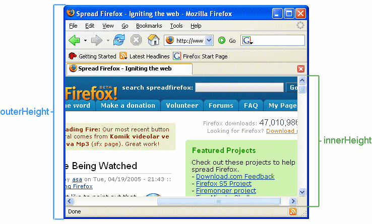

# window size

* `window.innerHeight/Width`

Provided by most browsers, but not Internet Explorer 8-, and even in Internet Explorer 9+, it is not available in quirks mode.

* `document.body.clientHeight/Width`

Provided by many browsers, including Internet Explorer.

* `document.documentElement.clientHeight/Width`

Provided by most DOM browsers, including Internet Explorer.

| Browser | window.innerHeight | document.body.clientHeight | document.documentElement.clientHeight |
| :---: | :---: | :---: | :---: |
|Opera 9.5+ strict | window | document |
| windowOpera 9.5+ quirks | window | window | document |
| Opera 7-9.2 | window | window | document |
| Opera 6 | window | window | N/A |
| Mozilla strict | window | document | window |
| Mozilla quirks | window | window | document |
| Newer KHTML | window | document | window |
| Older KHTML | window | document | document |
| Chrome/Safari 4+ | window | document | window |
| Safari 3- | window | document | document |
| iCab 3 | window | document | document |
| iCab 2 |window | window | N/A |
| IE 9+ strict | window | document | window |
| IE 6-8 strict | N/A | document | window |
| IE 5+ quirks | N/A | window | 0 |
| IE 4 | N/A | window | N/A |
| ICEbrowser | window | window | document |
| Tkhtml Hv3 | window | window | document |
| Netscape 4 | window | N/A | N/A |

### outerHeight vs innerHeight



* [Window.innerHeight](https://developer.mozilla.org/ko/docs/Web/API/Window/innerHeight)

### document height

#### Pure JavaScript

```javascript
function getDocHeight() {
    var D = document;
    return Math.max(
        D.body.scrollHeight, D.documentElement.scrollHeight,
        D.body.offsetHeight, D.documentElement.offsetHeight,
        D.body.clientHeight, D.documentElement.clientHeight
    );
}
```

#### jQuery

```javascript
$.getDocHeight = function(){
     var D = document;
     return Math.max(Math.max(D.body.scrollHeight,    D.documentElement.scrollHeight), Math.max(D.body.offsetHeight, D.documentElement.offsetHeight), Math.max(D.body.clientHeight, D.documentElement.clientHeight));
};
```

```javascript
$.getDocHeight = function(){
    return Math.max(
        $(document).height(),
        $(window).height(),
        /* For opera: */
        document.documentElement.clientHeight
    );
};
```

* [Get document height (cross-browser)](http://james.padolsey.com/javascript/get-document-height-cross-browser/)

### box-sizing

* [box-sizing](../CSS/height-and-width.md#box-sizing)

### Reference

* [Window size and scrolling](http://www.howtocreate.co.uk/tutorials/javascript/browserwindow)