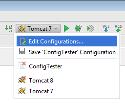
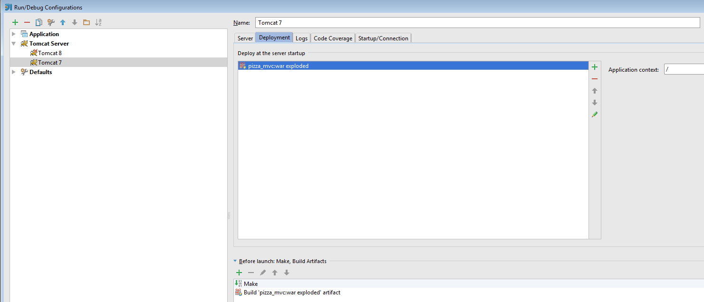
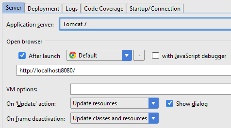

# Update Resources

1. open your Tomcat Run/Debug configuration (Run > Edit Configurations)

2. Go to the "Deployment" tab
3. In the "Deploy at Server Startup" section, remove (if present) the artifact `my-webapp-name:war`
4. Click the add icon, select 'artifact' and then select `my-webapp-name:war exploded`

5. Click OK (on the "Select Artifacts to Deploy" dialog)
6. Still in the Run/Debug Configuration Window, select the "Server" tab
7. In the middle of that tab, change the "On frame Deactivation" setting to either "Update resources" or "Update Classes and Resources"

	* Update resources: All changed resources (that is, all application components other than the classes) will be updated.
	* Update classes: and resources. All changed resources will be updated; changed classes will be recompiled. Note that whether the actual classes will be updated depends on the capabilities web server. If I recall, Tomcat will reload html/xhtml and jsp files, but not Servlets or classes that JSPs or Servlets use. You need to modified Tomcat to use a dynamic classloader for that.
8. You can also set the "On 'update' action as well.
	* This determined what happens when you hit the `Update icon` (or `Ctrl+F10`) in the Run window.
	* the "Show dialog" determines if IDEA prompts you each time you hit the update icon
9. Click OK.

### Reference

* [stack overflow](http://stackoverflow.com/questions/19596779/intellij-and-tomcat-changed-files-are-not-automatically-recognized-by-tomcat)

