# How to rotate an image

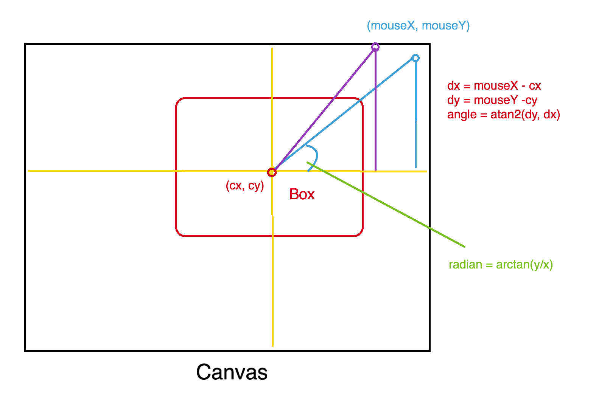

```javascript
var canvas=document.getElementById("canvas");
var ctx=canvas.getContext("2d");

var canvasOffset=$("#canvas").offset();
var offsetX=canvasOffset.left;
var offsetY=canvasOffset.top;

var isDown=false;

var cx=canvas.width/2;
var cy=canvas.height/2;

function handleMouseDown(e){
  mouseX=parseInt(e.clientX-offsetX);
  mouseY=parseInt(e.clientY-offsetY);
  drawRotationHandle(false);
  isDown=ctx.isPointInPath(mouseX,mouseY);
}

function handleMouseMove(e){
  if(!isDown){return;}

  mouseX=parseInt(e.clientX-offsetX);
  mouseY=parseInt(e.clientY-offsetY);
  var dx=mouseX-cx;
  var dy=mouseY-cy;
  r=Math.atan2(dy,dx);
  draw();
}

function drawRect(){
    ctx.save();
    ctx.translate(cx,cy);
    ctx.rotate(r);
    ctx.drawImage(img,0,0);
    ctx.restore();
}
```

### Math.atan2()

```javascript
Math.atan2(y, x)
```

>Parameters
>* y : First number.
>* x : Second number.
>
>Return value
>* The arctangent of the quotient of the given arguments.
>
>Description
>
>The ``Math.atan2()`` method returns a numeric value between -π and π representing the angle theta of an (x, y) point. This is the counterclockwise angle, measured in radians, between the positive X axis, and the point (x, y). Note that the arguments to this function pass the y-coordinate first and the x-coordinate second.
>
>``Math.atan2()`` is passed separate x and y arguments, and ``Math.atan()`` is passed the ratio of those two arguments.
>
>Because ``atan2()`` is a static method of Math, you always use it as ``Math.atan2()``, rather than as a method of a Math object you created (Math is not a constructor).
>
>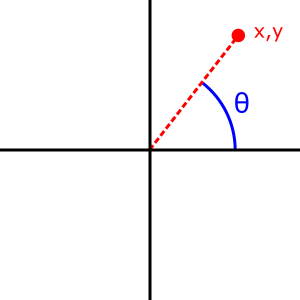
>
>[Math.atan2()](https://developer.mozilla.org/ko/docs/Web/JavaScript/Reference/Global_Objects/Math/atan2)

### Trigonometric Function &  Inverse Trigonometric Function

#### Trigonometric Function

삼각함수(trigonometric function)는 직각삼각형의 각을 직각삼각형의 변들의 길이의 비로 나타내는 함수이다. 이는 복소수의 지수 함수의 실수 · 허수 부분이며, 따라서 복소수를 다룰 때 핵심적인 역할을 한다. 가장 근본적인 주기함수이며, 각종 주기적 현상을 다룰 때 푸리에 급수의 형태로 등장한다.

삼각함수에는 3개의 기본 함수가 있으며, 이들은 사인(영어: sine, 기호 sin) · 코사인( 영어: cosine, 기호 cos) · 탄젠트(영어: tangent, 기호 tan)라고 한다. 이들의 역수는 각각 코시컨트(영어: cosecant, 기호 csc) · 시컨트(영어: secant, 기호 sec) · 코탄젠트(영어: cotangent, 기호 cot)라고 한다.

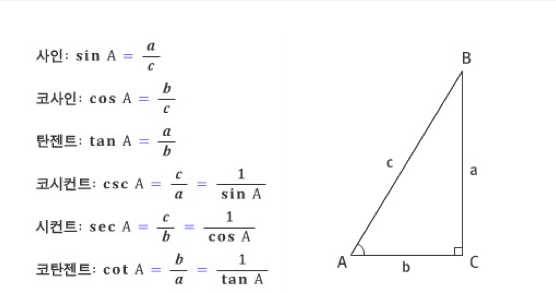

#### Inverse Trigonometric Function

역삼각 함수(영어: inverse trigonometric function)는 삼각 함수의 역함수이다. 삼각 함수는 단사 함수가 아니기 때문에 이의 역함수를 정의하려면 정의역을 제한하는 것이 필요하다.

* sinθ^-1^ = arcsinθ
* cosθ^-1^ = arccosθ
* tanθ^-1^ = arctanθ

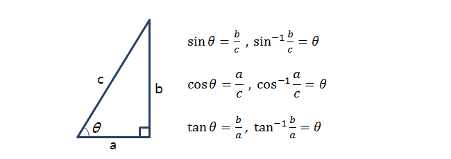


#### Get radian from trigonometric function

* θ = asin(r/y)
* θ = acos(r/x)
* θ = atan(y/x)

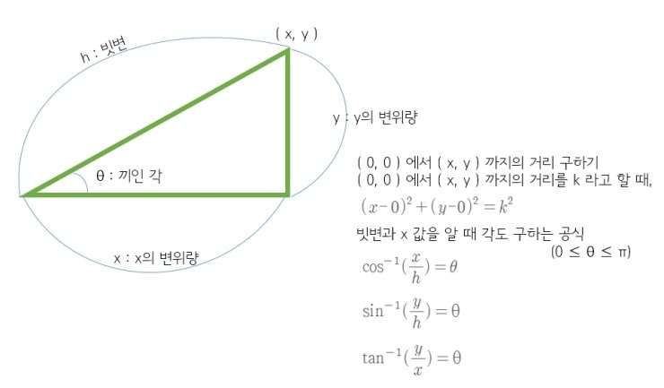

##### sinθ & arcsinθ

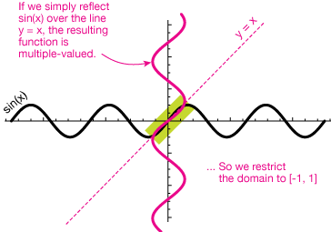

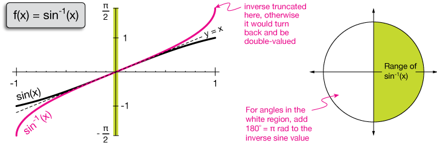

##### cosθ & arccosθ

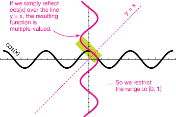

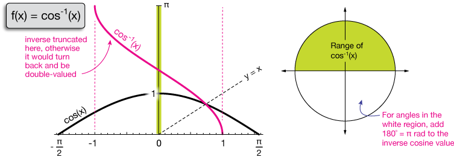

##### tanθ & arctanθ

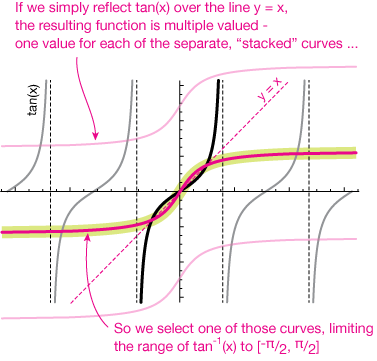

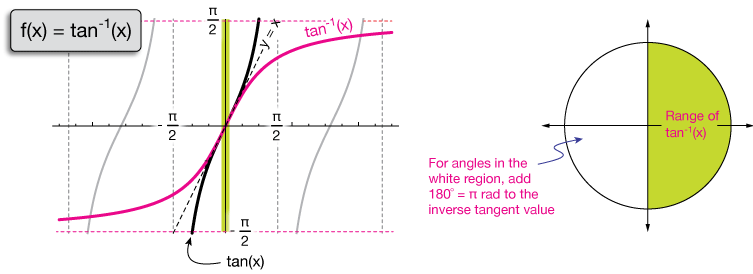


### Reference

* [stack overflow](http://stackoverflow.com/questions/19229319/to-rotation-an-image-in-canvas-using-mouse)
* [삼각함수 - 위키백과](https://ko.wikipedia.org/wiki/%EC%82%BC%EA%B0%81%ED%95%A8%EC%88%98)
* [역삼각함수 - 위키백과](https://ko.wikipedia.org/wiki/%EC%97%AD%EC%82%BC%EA%B0%81%ED%95%A8%EC%88%98)
* [MathInverseTrigFunctions](http://www.drcruzan.com/MathInverseTrigFunctions.html)