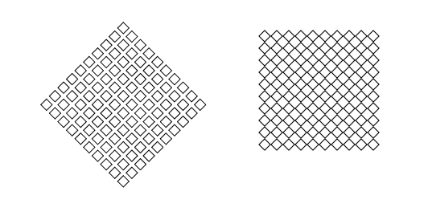

# 회전 변환

* x' = x * cosΘ - y * sinΘ
* y' = x * sinΘ + y * cosΘ


## 구현

```javascript
var canvas = document.getElementById('canvas');
var ctx = canvas.getContext('2d');
var boxes = generateBoxes(10, 10, {x:250, y:250});

function render() {
  for (var idx in boxes) {
    var box = boxes[idx];
    ctx.beginPath();
    for (var i = 0; i < box.bound.length; i++) {
      var position = getRotate(getRadian(box.normal), box.bound[i], {x:250, y:250});
      // var position = getRotate(getRadian(box.normal), box.bound[i], box.center);
      if (i == 0) {
        ctx.moveTo(position.x, position.y);
      } else {
        ctx.lineTo(position.x, position.y );
      }
    }
    ctx.closePath();
    ctx.stroke();
  }
}

function getRadian(normal) {
  var origin = {x: 0, y: 0};
  return Math.atan2(normal.y - origin.y, normal.x - origin.x);
}

function getRotate(radian, point, pivotPoint) {
  pivotPoint = pivotPoint != undefined ? pivotPoint : {x:0, y:0};
  var x = point.x - pivotPoint.x;
  var y = point.y - pivotPoint.y;
  var cos = Math.cos(radian);
  var sin = Math.sin(radian);

  return {
    x : (x * cos - y * sin) + pivotPoint.x,
    y : (x * sin + y * cos) + pivotPoint.y
  };
}

function generateBoxes (row, col, position, size, space) {
  position = position != undefined ? position : {x: 0, y: 0};
  size = size != undefined ? size : 10;
  space = space != undefined ? space : 5;

  var boxes = [];
  var offset = size + space;
  var center = size * 0.5;
  for (var r = 0; r < row; r++) {
    for (var c = 0; c < col; c++) {
      var centerX = position.x + offset * r + center;
      var centerY = position.y + offset * c + center;
      boxes.push({
        normal: {x:1, y:1},
        center: {x: centerX, y: centerY},
        bound: [
          {x: centerX - center, y: centerY - center},
          {x: centerX + center, y: centerY - center},
          {x: centerX + center, y: centerY + center},
          {x: centerX - center, y: centerY + center}]
      });
    }
  }
  return boxes;
}
```

* [Plunker](https://plnkr.co/edit/va5xfX?p=preview)



`pivot` 위치에 따라 각 도형들이 회전할지 전체 도형들이 회전할지 결정된다.

## Reference

* [회전 변환 식 유도](http://blog.naver.com/PostView.nhn?blogId=dalsapcho&logNo=20144939371&categoryNo=29&viewDate=&currentPage=1&listtype=0)
