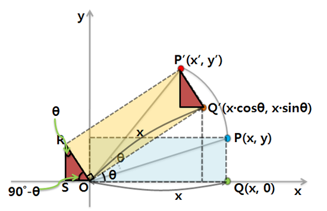
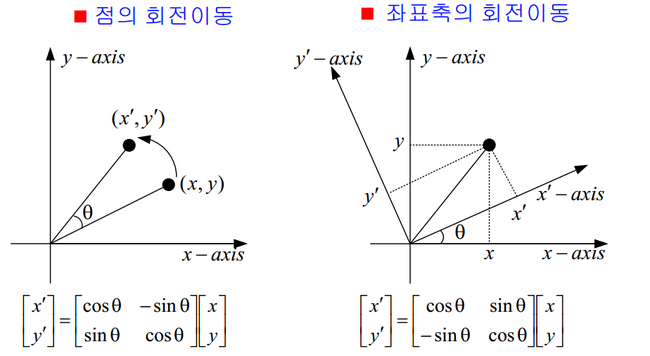

# 회전 변환

* x' = x * cosΘ - y * sinΘ
* y' = x * sinΘ + y * cosΘ

## Reference

* [회전 변환 식 유도](http://blog.naver.com/PostView.nhn?blogId=dalsapcho&logNo=20144939371&categoryNo=29&viewDate=&currentPage=1&listtype=0)
