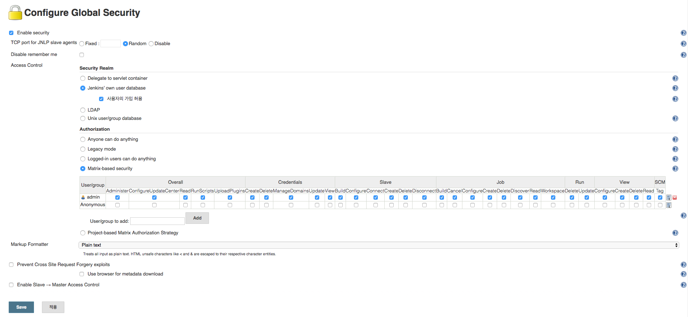

# Linux에 Jenkins 설치하기

### 준비

* [JDK 설치](./jdk-installation-for-linux.md)
* [Tomcat 설치](./tomcat-installation-for-linux.md)
* [Maven 설치](./maven-installation-for-linux.md)
* [Git 설치](./git-installation-for-centos-without-yum.md)
 
### 다운로드

[http://jenkins-ci.org/](http://jenkins-ci.org/)에서 ``jenkins.war`` 파일을 다운받고 Tomcat에 Deploy한다.(Tomcat의 ``webapps``폴더에 넣고 Tomcat을 싱행하면 자동으로 Deploy된다.)

### 시스템 설정 (Jenkins 관리 > 시스템 설정)

#### JDK 설정


* ``Install automatically``의 체크를 해제한다.
* ``Name``과 ``JAVA_HOME``을 입력한다.

```
Name : JAVA_HOME
JAVA_HOME : /usr/local/java
```

### Maven 설정


* ``Install automatically``의 체크를 해제한다.
* ``Name``과 ``MAVEN_HOME``을 입력한다.

```
Name : M2_HOME
MAVEN_HOME : /opt/maven
```

### Plugin 설치 (Jenkins 관리 > 플러그인 관리 > 설치 가능)

#### Github plugin


#### Deploy to container Plugin


``Tomcat Manager``를 통한 ``Deploy``하고자하면 설치하고, 아래와 같은 코드를 ``%TOMCAT_HOME%/conf/tomcat-users.xml``에 수정해주어야 한다.

```xml
<role rolename="manager-gui"/>
<role rolename="mamager-script"/>
<role rolename="manager-status"/>
<user username="tomcat" password="tomcat" roles="manager-gui,manager-script,manager-status"/>
```

### Security 설정



* ``Enable security`` 를 체크한다.
* ``Security Realm`` 그룹에서 ``Jenkins's own user database``를 클릭하고 하위의 ``Allow users to sign up``을 체크한다.
* ``Authroization`` 그룹에서 ``Matrix-based security``를 체크한다.
* 사용자를 추가하고 추가한 사용자로 가입하여 로그인한다.


### 프로젝트 생성

#### 프로젝트 생성 (새로운 Item > Item 이름 입력 > Maven project)


#### Git 설정


Github의 소스가 commit되면 자동으로 build를 하기 위해 ``Build when a change is pushed to GitHub``를 체크한다.


Github를 통해 소스를 Deploy하기 위해 Github에 있는 ``Respository URL``을 입력하고 ``Credentials``을 추가한다.

### Build (생성된 프로젝트 선택 > Build Now)


생성된 프로젝트가 build 후 deploy가 되는 것을 볼 수 있다.

### Freestyle project로 생성하는 경우에 Maven build 설정 (새로운 Item > Item 이름 입력 > Freestyle project)


Freestyle project로 생성해서 Maven을 사용하여 build해야 되는 경우에는 ``Add build step``으로 ``Invoke top-level Maven targets``을 추가하고 ``Maven Version``과 ``Goals``을 설정해준다.

```
Maven Version : M2_HOME
Goals : clean install
```

### Reference

* [젠킨스 설치 및 설정](http://www.slideshare.net/sunnykwak90/ss-59330863)
* [[jenkins] 설치 및 배포](http://blog.woniper.net/201)
* [[Jenkins] 설치후 Security 설정하기](http://mobicon.tistory.com/145)
* [Jenkin 설치 및 설정하기](http://sayingublog.blogspot.kr/2015/06/jenkin.html)
* [How to deploy Maven based war file to Tomcat](http://www.mkyong.com/maven/how-to-deploy-maven-based-war-file-to-tomcat/)
* [Jenkins 에서 Build a maven2/3 project 로 job 설정하기](http://blog.nuriware.com/archives/934)
