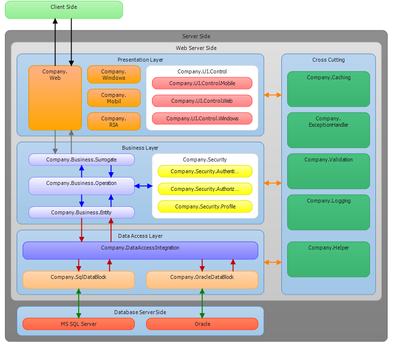

# 3 Layered Architecture

## 프리젠테이션 계층(Presentation Layer)
사용자로부터 요청을 받고 응답을 처리하는 계층이다. 하위 계층에서 발생하는 Exception이나 Error에 대한 처리를 맡으며, 최종 프리젠테이션 계층에 표현해야 할 도메인 모델을 엮는 기능, 사용자로부터 받은 데이터의 유효성 검증(Validation)을 처리 한다.

## 비즈니스 계층(Business Layer)
애플리케이션의 비즈니스 로직 처리와 비즈니스와 관련된 도메인 모델의 적합성을 검증한다. 또한, 트랜잭션 처리와 제어 계층과 퍼시스턴스 계층 사이를 연결하는 역할로서 두 계층이 직접적으로 통신하지 않게 하여 애플리케이션의 유연성을 증가시킨다.

## 퍼시스턴스 계층(Persistence Layer)
영구 데이터를 빼내어 객체화 시키며, 영구 저장소에 데이터를 저장, 수정, 삭제하는 계층이다. 즉, 데이터베이스나 파일에 접근하여 데이터를 CRUD 하는 계층이다.

## 참조

* [계층화 아키텍처(Layered architecture)](http://blog.daum.net/question0921/797)
* [LAYERED ARCHITECTURE(계층형 아키텍처)](http://wikibook.co.kr/article/layered-architecture/)