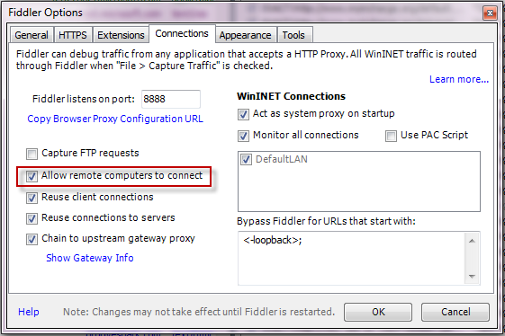
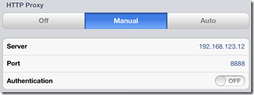
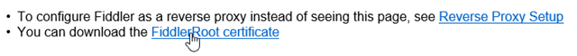
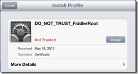
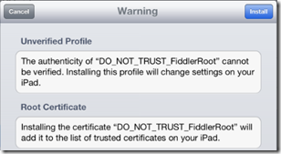

# Https proxy sever by Fiddler4 with iOS

## Configure Fiddler

1. Click `Tools` > `Fiddler Options` > `Connections`.
2. Click the checkbox by `Allow remote computers to connect`.

3. Restart Fiddler.
4. Ensure your firewall allows incoming connections to the Fiddler process.
5. Hover over the `Online indicator` at the far right of the Fiddler toolbar to display the IP addresses assigned to Fiddler's machine.

6. Verify client iOS device can reach Fiddler by navigating in the browser to `http://FiddlerMachineIP:8888`. This address should return the `Fiddler Echo Service` page.
7. For iPhone: Disable the 3g/4g connection.

## Set the iOS Device Proxy

1. Tap `Settings` > `General` > `Network` > `Wi-Fi`.
2. Tap the settings for the Wi-Fi network.
3. Tap the `Manual` option in the `HTTP Proxy` section.
4. In the `Server` box, type the IP address or hostname of your Fiddler instance.
5. In the `Port` box, type the port Fiddler is listening on (usually 8888).
6. Ensure the Authentication slider is set to `Off`.

## Decrypt HTTPS Traffic from iOS Devices

1. Download the [Certificate Maker plugin](http://fiddler2.com/add-ons) for Fiddler.
2. Install the `Certificate Maker` plugin.
3. Restart Fiddler.
4.Configure the device where Fiddler is installed to [trust Fiddler root certificate](http://docs.telerik.com/fiddler/Configure-Fiddler/Tasks/TrustFiddlerRootCert).
5. On the iOS device, go to http://ipv4.fiddler:8888/ in a browser.
6. From the bottom of the `Fiddler Echo Service webpage`, download the `FiddlerRoot certificate`.

7. Open the `FiddlerRoot.cer` file.
8. Tap the `Install` button.

9. Tap the `Install` button again.

## Uninstall FiddlerRoot Certificate

If you decide to uninstall the root certificate:

1. Tap the `Settings1 app.
2. Tap `General`.
3. Scroll to `Profiles`.
4. Tap the `DO_NOT_TRUST_FiddlerRoot*` profile.
5. Tap `Remove`.

## File Proxy

* AutoResponder 변경할 주소와 파일을 추가한다.

## Reference

* [Capture Traffic from iOS Device](http://docs.telerik.com/fiddler/Configure-Fiddler/Tasks/ConfigureForiOS)
* [iOS에서 host 변경 테스트를 위해 Fiddler4를 활용한 HTTPS Proxy 서버 만들기](http://blog.hanseomgi.com/entry/iOS%EC%97%90%EC%84%9C-host-%EB%B3%80%EA%B2%BD-%ED%85%8C%EC%8A%A4%ED%8A%B8%EB%A5%BC-%EC%9C%84%ED%95%B4-Fiddler4%EB%A5%BC-%ED%99%9C%EC%9A%A9%ED%95%9C-HTTPS-Proxy-%EC%84%9C%EB%B2%84-%EB%A7%8C%EB%93%A4%EA%B8%B0)