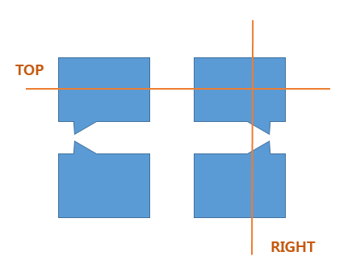

# Tooltip



```javascript
function drawTooltip (texts) {
    if (!texts || !Array.isArray(texts)) {
        return;
    }

    var startPosition = {
        x: mouseX,
        y: mouseY
    };

    var font = "15px Arial";
    var textWidth = getTextWidth(texts, font) + 10;
    var textHeight = 22;
    var width = (textWidth < 100 ? 100 : textWidth) + 10;
    var height = texts.length * textHeight + 10;

    var isRightOver = startPosition.x + width > tklMatrixState.clientViewSize.width;
    var isTopOver = startPosition.y - height < 0;

    var originX = startPosition.x;
    var originY = startPosition.y;
    var right = startPosition.x + (isRightOver ? -1 * width : width);
    var top = startPosition.y + (isTopOver ? height : -1 * height);
    var tailX = startPosition.x + (isRightOver ? -10 : 10);
    var tailY = startPosition.y + (isTopOver ? 7 : -7);
    var textLeft = isRightOver ? right + 10 : originX + 10;
    var textTop = top + (isTopOver ? -1 * 10 : 15);

    // Tooltip
    ctx.save();
    ctx.setTransform(1, 0, 0, 1, 0, 0);

    // Tooltip 박스
    ctx.save();
    ctx.globalAlpha = 0.7;
    ctx.beginPath();
    ctx.moveTo(originX, originY);
    ctx.lineTo(originX, top);
    ctx.lineTo(right, top);
    ctx.lineTo(right, tailY);
    ctx.lineTo(tailX, tailY);
    ctx.closePath();
    ctx.fill();
    ctx.restore();

    // Tooltip 텍스트
    ctx.save();
    ctx.fillStyle = "white";
    ctx.fontWeight = "bold";
    ctx.font = font;

    for (var idx = 0; idx < texts.length; idx++) {
        var text = texts[idx];
        var x = textLeft;
        var y = textTop + idx * (isTopOver ? -1 * textHeight : textHeight);
        ctx.fillText(text, x, y);
    }

    ctx.restore();

    ctx.restore();
}

function getTextWidth (texts, font) {
    var maxTextWidth = 0;
    var textCanvas = angular.element('<canvas></canvas>')[0];
    var textCtx = textCanvas.getContext("2d");
    textCtx.font = font;

    for (var idx = 0; idx < texts.length; idx++) {
        var text = texts[idx];
        var textWidth = textCtx.measureText(text).width;

        if (textWidth > maxTextWidth) {
            maxTextWidth = textWidth;
        }
    }

    return maxTextWidth;
}
```